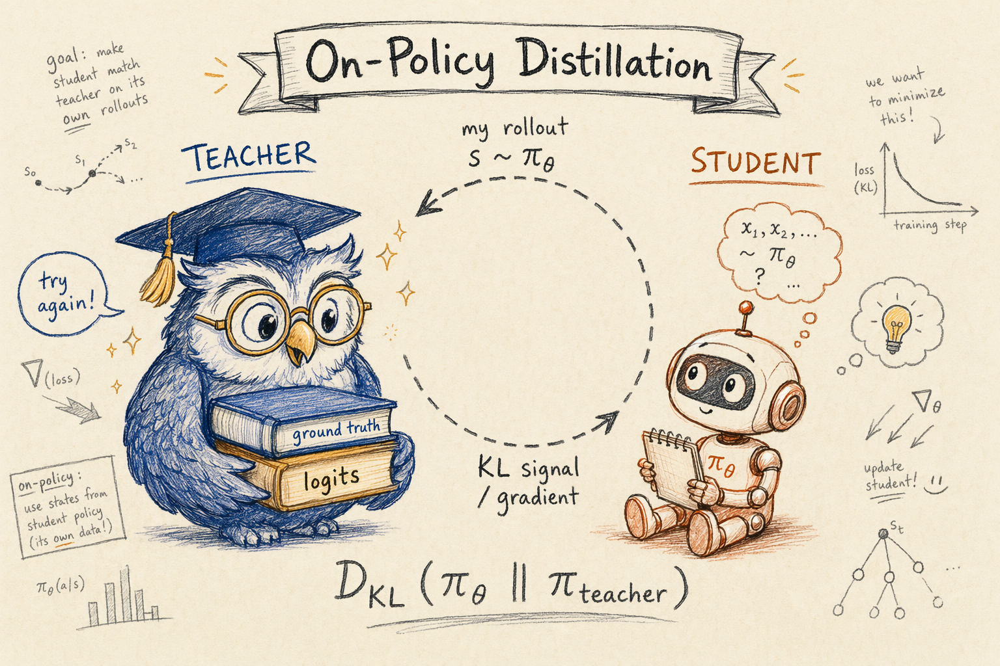
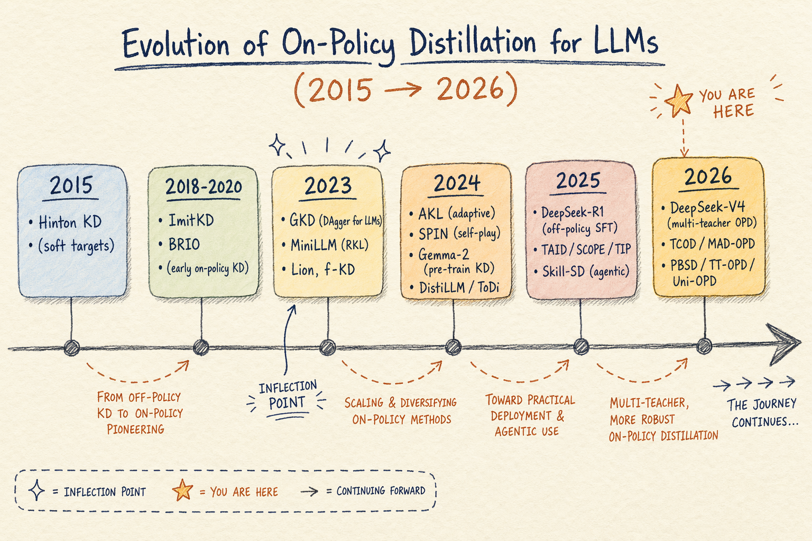
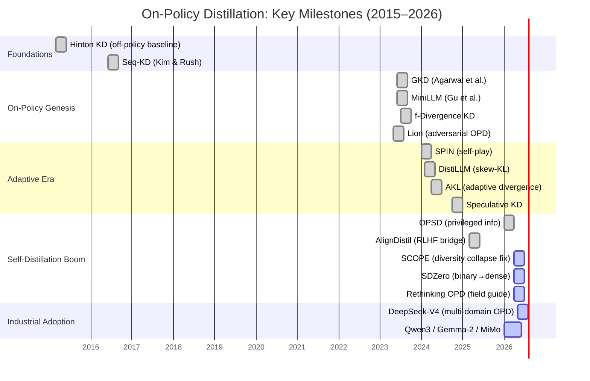
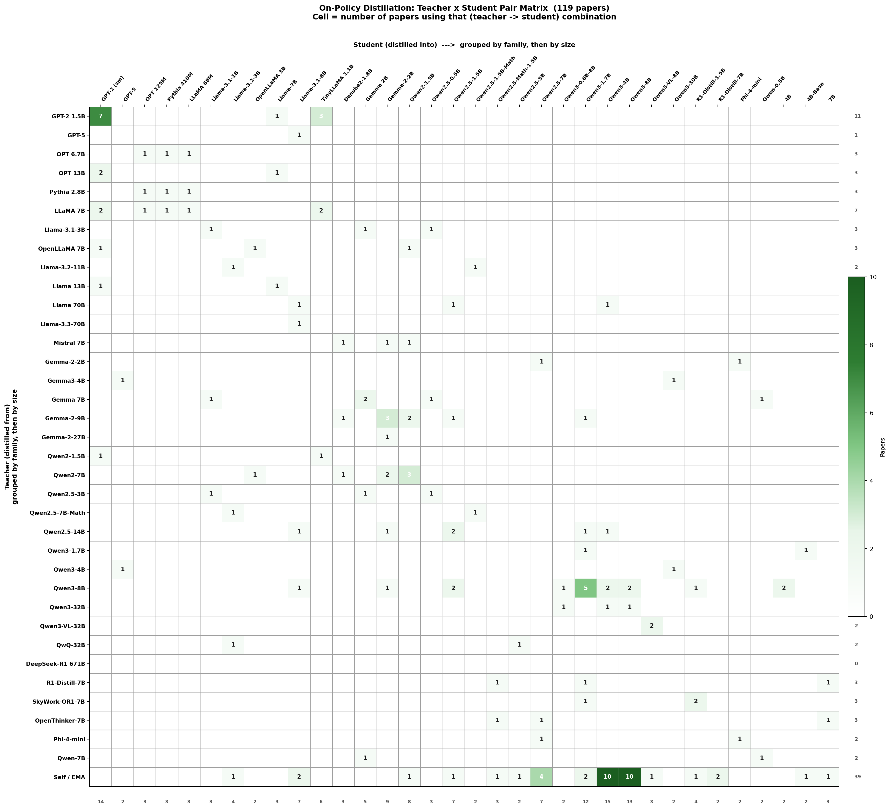

<a name="readme-top"></a>

<div align="center">
  <a href="https://github.com/nick7nlp/Awesome-LLM-On-Policy-Distillation/stargazers"></a>
  <a href="https://github.com/nick7nlp/Awesome-LLM-On-Policy-Distillation/network/members"></a>
  <a href="https://github.com/nick7nlp/Awesome-LLM-On-Policy-Distillation/graphs/contributors"></a>
  <a href="https://github.com/nick7nlp/Awesome-LLM-On-Policy-Distillation/blob/master/LICENSE"></a>
</div>

<br/>

<h1 align="center">🔥 Awesome LLM On-Policy Distillation</h1>

<p align="center">
  <b>A curated collection of papers and resources on On-Policy Distillation for Large Language Models.</b>
</p>

<p align="center">
  <a href="https://awesome.re"></a>
  
  
  
</p>

<p align="center">
  
</p>

## 🤔 Why On-Policy? — The Core Problem

Traditional off-policy distillation (e.g., SFT on teacher demonstrations) suffers from **exposure bias** and **train-test mismatch**: the student learns to predict the next token given perfect teacher prefixes, but during inference, it must condition on its own flawed generations. Errors compound rapidly.

**On-policy distillation (OPD)** solves this by forcing the student to generate trajectories from its own distribution, and then evaluating those trajectories using a teacher model, reward model, or verifier. The student learns to correct its *own* mistakes in its *own* state space.

With the rise of reasoning models (System 2 thinking) in 2024–2026, long chains of thought exacerbate compounding errors. Off-policy SFT is no longer sufficient. OPD has become the indispensable post-training paradigm for scaling reasoning, adopted by frontier models like DeepSeek-V4, Qwen3, Gemma-2, Nemotron, and MiMo.

<p align="center">
  📖 <b>Survey Paper:</b> <a href="https://arxiv.org/abs/2604.00626">A Survey of On-Policy Distillation for Large Language Models</a>
</p>

<p align="center">
  🟢 = Covered in our <a href="https://arxiv.org/abs/2604.00626">survey paper</a> &nbsp;|&nbsp; 🟡 = Indexed here, pending inclusion in the next survey revision
</p>

---

<details>
  <summary>📑 <b>Table of Contents</b></summary>
  <ol>
    <li><a href="#-why-on-policy">Why On-Policy?</a></li>
    <li><a href="#-recently-added-may-2026">🆕 Recently Added</a></li>
    <li><a href="#-quick-start-guide">Quick-Start Guide</a></li>
    <li><a href="#-trends--highlights-2025-2026">Trends &amp; Highlights</a></li>
    <li><a href="#-survey-version-history">📋 Survey Version History</a></li>
    <li><a href="#-teacherstudent-model-atlas">🔍 Teacher–Student Model Atlas</a></li>
    <li><a href="#-hall-of-fame--must-read-opd-papers-by-era">🏆 Hall of Fame</a></li>
    <li><a href="#%EF%B8%8F-taxonomy">Taxonomy</a></li>
    <li><a href="#4-objective-functions-and-optimization">§4 Objective Functions &amp; Optimization</a>
      <ul>
        <li><a href="#41-fixed-divergence-objectives">§4.1 Fixed Divergence Objectives</a></li>
        <li><a href="#42-adaptive-divergence-objectives">§4.2 Adaptive Divergence Objectives</a></li>
        <li><a href="#43-rl-augmented-objectives">§4.3 RL-Augmented Objectives</a></li>
      </ul>
    </li>
    <li><a href="#5-signal-source-and-teacher-architecture">§5 Signal Source &amp; Teacher Architecture</a>
      <ul>
        <li><a href="#51-white-box-logit-supervision">§5.1 White-Box Logit Supervision</a></li>
        <li><a href="#52-black-box-and-api-constrained">§5.2 Black-Box &amp; API-Constrained</a></li>
        <li><a href="#53-self-distillation">§5.3 Self-Distillation</a>
          <ul>
            <li><a href="#531-privileged-information">§5.3.1 Privileged Information</a></li>
            <li><a href="#532-pure-self-distillation">§5.3.2 Pure Self-Distillation</a></li>
            <li><a href="#533-external-feedback">§5.3.3 External Feedback</a></li>
          </ul>
        </li>
      </ul>
    </li>
    <li><a href="#6-training-efficiency-and-stabilization">§6 Training Efficiency &amp; Stabilization</a></li>
    <li><a href="#7-understanding-opd">§7 Understanding OPD</a>
      <ul>
        <li><a href="#71-success-conditions--empirical-analyses">§7.1 Success Conditions</a></li>
        <li><a href="#72-failure-modes--diagnostics">§7.2 Failure Modes</a></li>
        <li><a href="#73-unified-theoretical-perspectives">§7.3 Unified Theory</a></li>
      </ul>
    </li>
    <li><a href="#8-applications-systems-and-emerging-domains">§8 Applications, Systems &amp; Emerging Domains</a>
      <ul>
        <li><a href="#81-industrial-deployment">§8.1 Industrial Deployment</a></li>
        <li><a href="#82-emerging-domains">§8.2 Emerging Domains</a></li>
        <li><a href="#83-system-level-integration">§8.3 System-Level Integration</a></li>
      </ul>
    </li>
    <li><a href="#9-open-problems">§9 Open Problems</a></li>
    <li><a href="#-pending-papers-">📋 Pending Papers</a></li>
    <li><a href="#-additional-resources">Additional Resources</a></li>
    <li><a href="#-faq">FAQ</a></li>
    <li><a href="#-contributing">Contributing</a></li>
    <li><a href="#-citation">Citation</a></li>
  </ol>
</details>

---

<details>
<summary>🆕 <b>Recently Added (May 2026)</b></summary>

| Paper | Section | Key Idea |
|-------|:-------:|----------|
| [Teacher-Guided Policy Optimization](https://arxiv.org/abs/2605.13230) | §4.3 | Dense directional teacher guidance on student rollouts |
| [Respecting Self-Uncertainty](https://arxiv.org/abs/2605.13255) | §6 | Entropy-guided confidence gate for efficient self-distillation |
| [GEAR: Granularity-Adaptive Advantage Reweighting](https://arxiv.org/abs/2605.11853) | §6 | Adaptive segment-level advantage for agentic self-distillation |
| [Reward-Weighted OPD for NL-to-SVA](https://arxiv.org/abs/2605.13501) | §8.2 | Verifier-reward-weighted FKL on student rollouts |
| [Revisiting DAgger for LLM-Agents](https://arxiv.org/abs/2605.12913) | §8.2 | Turn-level student-teacher interpolation for SWE agents |
| [Prefix Teach, Suffix Fade](https://arxiv.org/abs/2605.13643) | §7.2 | Local teachability collapse in strong-to-weak OPD |
| [Multi-Rollout OPD via Peer Successes](https://arxiv.org/abs/2605.12652) | §5.1 | Peer-conditioned teacher signals from success/failure rollouts |
| [HyperEyes](https://arxiv.org/abs/2605.07177) | §8.2 | Micro-level OPD for parallel multimodal search agents |
| [Training with Harnesses](https://arxiv.org/abs/2605.08741) | §5.3.2 | Harness-augmented model as teacher for complex reasoning |
| [ProteinOPD](https://arxiv.org/abs/2605.10189) | §8.2 | Geometric multi-teacher OPD for protein design |
| [TRACE: Token-Routed Self-OPD Alignment](https://arxiv.org/abs/2605.10194) | §6 | Token-routed FKL on key spans + RKL on error spans |
| [Safactory](https://arxiv.org/abs/2605.06230) | §8.1 | Scalable agentic pipeline for trustworthy training |
| [AOPD: Asymmetric On-Policy Distillation](https://arxiv.org/abs/2605.06387) | §4.2 | Localized divergence minimization replacing negative RL |
| [Near-Policy Distillation](https://arxiv.org/abs/2605.05940) | §6 | Async generation + Δ-IFD filtering for 8.1× speedup |
| [OPSD Compresses What RLVR Teaches](https://arxiv.org/abs/2605.06188) | §7.1 | OPSD as post-RL compression stage for reasoning models |
| [VISD: Video Reasoning via Structured Self-Distillation](https://arxiv.org/abs/2605.06094) | §5.3.1 | Video-aware quality decomposition as privileged info |

</details>

---

## 🧭 Quick-Start Guide

> 👋 New to On-Policy Distillation? Start here — we've got you covered.

- **"If you only read 3 papers":** [GKD](https://arxiv.org/abs/2306.13649) (Foundation) + [MiniLLM](https://arxiv.org/abs/2306.08543) (Reverse-KL default) + [Rethinking OPD](https://arxiv.org/abs/2604.13016) (Field guide / failure modes).
- **"If you work on math reasoning":** Follow the trajectory: [OPSD](https://arxiv.org/abs/2601.18734) → [RLKD](https://arxiv.org/abs/2505.16142) → [SCOPE](https://arxiv.org/abs/2604.10688).
- **"If you build multi-turn agents":** Look into [SOD](https://arxiv.org/abs/2605.07725) (step-wise reweighting to prevent error cascades in tool-integrated reasoning).
- **"If your teacher and student use different tokenizers":** See [SimCT](https://arxiv.org/abs/2605.07711) (multi-token continuation units recover supervision lost at vocabulary boundaries).
- **"If you only have API access to the teacher":** Try [ROPD](https://arxiv.org/abs/2605.07396) (rubric-based OPD: structured rubrics replace teacher logits, black-box compatible, up to 10x sample efficiency).
- **"If you want to combine RL and distillation":** Start with [SRPO](https://arxiv.org/abs/2604.02288) (sample routing between RL and OPD objectives based on per-sample teacher agreement).

### 💡 Practitioner's Decision Tree

```text
Can you access the teacher's full logits?
├── Yes → White-Box Signal (§5.1)
│   ├── Same tokenizer? → GKD / MiniLLM / DistiLLM (§4.1, §5.1)
│   └── Different tokenizer? → ULD / DSKD (§5.1)
├── API outputs only? → Black-Box Signal (§5.2)
│   └── Lion / GAD / OVD / PRISM (§5.2)
└── No teacher at all → Self-Distillation (§5.3)
    ├── Have a Verifier / RM? → SDPO / SD-ZERO / RLSD / CREDIT / OGLS-SD (§5.3.3)
    ├── Have privileged context? → OPSD / PAINT / PBSD / TT-OPD (§5.3.1)
    └── Pure self-iteration? → SPIN / IRIS / On-Policy SFT (§5.3.2)

Which objective should the optimizer use?
├── Fixed, simple baseline → Forward/Reverse KL, JSD (§4.1)
├── Token/position adaptive → AKL / ToDi / DDT / EDGE (§4.2)
└── Reward-shaped → G-OPD / RLAD / KDRL / AlignDistil / MAD-OPD (§4.3)

Training unstable or inefficient?
└── Dynamics toolbox → TIP / SCOPE / TCOD / Uni-OPD / PACED / Lightning-OPD (§6)
```

## 🔥 Trends & Highlights (2025–2026)

> 💡 Six shifts defining the OPD landscape right now.

1. 🎯 **From RKL to Adaptive**: The field initially defaulted to Reverse-KL (mode-seeking). Recent work shifted toward adaptive switching (AKL, token-level gates, entropy-weighted objectives) to balance exploration and guidance.
2. 💥 **The Self-Distillation Boom**: Teacher-free on-policy methods (SDPO, SDZero, SRPO) are dominating, relying on rule-based verifiers or reward models rather than white-box teacher models.
3. ✂️ **Token Importance**: Papers like TIP, SCOPE, and SelecTKD revealed that applying KD loss to 100% of tokens is inefficient. Selecting the top 20-50% high-entropy/divergence tokens achieves parity.
4. 🤖 **Agentic OPD**: Methods like SOD and Skill-SD address the massive compounding errors in tool-integrated reasoning and long-horizon agents through step-level divergence reweighting and skill-level decomposition.
5. 🏭 **Industrial Adoption**: The latest frontier models (DeepSeek-V4, Qwen3, Nemotron, Gemma-2, and MiMo) have fully integrated OPD into their post-training pipelines.
6. ⚠️ **Diversity Collapse**: A critical finding from SCOPE shows that while OPD drastically improves Pass@1, it severely harms Pass@k due to diversity collapse, prompting new hybrid objective designs.

### ⏳ Evolution Timeline

<p align="center">
  
</p>

<details>
<summary>📊 <b>Interactive Mermaid Timeline (click to expand)</b></summary>



</details>

---

## 📋 Survey Version History

> Version evolution of our [survey paper](https://arxiv.org/abs/2604.00626).

| Version | Date | Pages | Bib Entries | Key Changes |
|:-------:|:----:|:-----:|:-----------:|-------------|
| V1 | 2026-04-01 | 39 | 73 | Initial release on arXiv |
| V2 | 2026-05-09 | 59 | 124 | Extended coverage across all sections; added §6 Training Efficiency, §8.2 Emerging Domains |
| V3 (current) | 2026-05 | 62+ | 150 | New §3 Method Landscape & Selection; §7.4 On-Policy vs Off-Policy Decision Framework |

<p align="right">(<a href="#readme-top">back to top</a>)</p>

---

## 🔍 Teacher–Student Model Atlas

> 🎯 "I have model X — what can I distill, and from whom?" This atlas maps the OPD ecosystem's model choices across 175 papers.

<p align="center">
  
</p>

> 📊 **Y-axis** = teacher models. **X-axis** = student models. Grouped by family, sorted by size within each family. **Cell** = papers using that (teacher → student) pair. **①-⑤** = frequency rank (most-used teachers / students). Thick lines = family boundaries. Marginal Σ on edges.

### 💡 Key Takeaways

- 👑 **Qwen3-8B is king** — most used teacher (115 pairs) and #2 student (82 pairs)
- 💪 **Self-distillation dominates** — 328 pairs (38%) use the model as its own teacher
- 🎯 **Student sweet spot = 1.7B–8B** — Qwen3-4B (103), Qwen3-8B (82), Qwen3-1.7B (79)
- 🏭 **Teacher sweet spot = 4B–32B** — Qwen3-8B (115), Qwen3-4B (79), Qwen2.5-7B (34)
- 🌍 **Qwen-family hegemony** — appears in 67% of teacher-student pairs (Qwen3 alone: 46%)
- 🔄 **Clear cascade** — 235B → 32B → 8B → 4B → 1.7B → 0.6B
- 📚 **GPT-2 / T5 / Llama** persist as academic benchmarks


<p align="right">(<a href="#readme-top">back to top</a>)</p>

## 🏆 Hall of Fame — Must-Read OPD Papers by Era

> Start here if you're new to the field. Organized by era to show how OPD evolved. These papers focus on **OPD methodological contributions** with the highest conceptual influence. Industrial deployment reports (DeepSeek-V4, Gemma-2, Qwen3, etc.) are in [§8.1](#81-industrial-deployment).

### 🏛️ Foundations (2023)

| Paper | Why Read It |
|-------|-------------|
| [**GKD: On-Policy Distillation of Language Models**](https://arxiv.org/abs/2306.13649) | The canonical on-policy KD formulation. DAgger analogy, unified loss over F-KL / R-KL / JSD. The starting point of modern OPD. |
| [**MiniLLM**](https://arxiv.org/abs/2306.08543) | Shows Reverse-KL beats Forward-KL for mode-seeking small students. Made RKL the default OPD objective. |
| [**f-Divergence KD**](https://arxiv.org/abs/2307.15190) | Unifying f-divergence framework for sequence-level KD. Subsumes KL, RKL, JSD, α-divergence. Essential theory. |
| [**Lion**](https://arxiv.org/abs/2305.12870) | Adversarial distillation from proprietary LLMs. Pioneered black-box OPD with iterative refinement. |

### 🔬 Evolution (2024)

| Paper | Why Read It |
|-------|-------------|
| [**AKL: Rethinking KL for LLM KD**](https://arxiv.org/abs/2404.02657) | First principled *adaptive* divergence: F-KL and R-KL focus on head/tail respectively; AKL mixes them. Opens the adaptive line (§4.2). |
| [**DistiLLM**](https://arxiv.org/abs/2402.03898) | Skew-KL + on-policy scheduling. Template for production OPD pipelines. |
| [**SPIN**](https://arxiv.org/abs/2401.01335) | Self-play as OPD without external teacher. Foundation of the self-distillation (§5.3) branch. |
| [**Speculative KD**](https://arxiv.org/abs/2410.11325) | Interleaved teacher-student sampling bridges exposure-bias elegantly. Influential trajectory construction pattern. |

### 🚀 Frontier (2025–2026)

| Paper | Why Read It |
|-------|-------------|
| [**OPSD: Self-Distilled Reasoner**](https://arxiv.org/abs/2601.18734) | Canonical privileged-information method. Oracle answer as privileged context. Defines the §5.3.1 paradigm. |
| [**AlignDistil**](https://arxiv.org/abs/2503.02832) | Reframes token-level alignment as adaptive OPD: reward signals → divergence weights. Bridge between RLHF and distillation. |
| [**Rethinking OPD**](https://arxiv.org/abs/2604.13016) | Two necessary conditions for OPD success + taxonomy of failure modes. Field guide for "what can go wrong." |
| [**SCOPE**](https://arxiv.org/abs/2604.10688) | Dual-path adaptive weighting; reveals diversity collapse in OPD. Fixes Pass@k degradation. |
| [**SDZero**](https://arxiv.org/abs/2604.12002) | Self-revision turns binary rewards into dense supervision. Teacher-free self-distillation frontier. |
| [**SOD**](https://arxiv.org/abs/2605.07725) | Step-level divergence reweighting for tool-integrated reasoning agents. Attenuates teacher signal in high-divergence steps; surfaces step granularity as the missing unit between token and trajectory. |

<details>
<summary>📖 <b>Recommended Reading Order for Different Backgrounds</b></summary>

- **ML Researcher (theory-first):** f-Divergence KD → GKD → MiniLLM → AKL → Rethinking OPD
- **Practitioner (methods-first):** GKD → DistiLLM → Speculative KD → OPSD → AlignDistil
- **Newcomer:** GKD → MiniLLM → SPIN → OPSD → Rethinking OPD
- **Self-distillation focus:** SPIN → OPSD → SDZero → AlignDistil → SCOPE
- **Divergence / objective theory:** f-Divergence KD → MiniLLM → AKL → DistiLLM

> Large-scale industrial reports that *use* OPD in production (DeepSeek-V4, Gemma-2, Qwen3, Nemotron-Cascade, MiMo-V2) are collected separately under **[§8.1 Industrial Deployment](#81-industrial-deployment)** since they are system papers rather than OPD method contributions. The off-policy baseline DeepSeek-R1 is discussed in **§7.4** as the counter-example that motivates OPD.

</details>

<p align="right">(<a href="#readme-top">back to top</a>)</p>

## 🗺️ Taxonomy

> Organized to mirror the [OPD Survey V3](https://arxiv.org/abs/2604.00626) section structure.

### 📜 Full Tree

```
On-Policy Distillation (Survey V3 Structure)
│
├── §4 Objective Functions & Optimization
│   ├── §4.1 Fixed Divergence Objectives
│   │         (KL/reverse-KL, JSD, skew-KL, concrete score matching)
│   ├── §4.2 Adaptive Divergence Objectives
│   │         (AKL, ToDi, DDT, DASD, EDGE, relaxed / stable targets)
│   └── §4.3 RL-Augmented Objectives
│             (KL-constrained RL, G-OPD, KDRL, RLAD, AlignDistil, MAD-OPD, Beyond-GRPO, dGRPO, CoDistill-GRPO, TGPO)
│
├── §5 Signal Source & Teacher Architecture
│   ├── §5.1 White-Box Logit Supervision
│   │         (full logit access; cross-tokenizer / dual-space alignment)
│   ├── §5.2 Black-Box & API-Constrained
│   │         (verbal / score feedback, adversarial, off-policy guidance)
│   └── §5.3 Self-Distillation
│       ├── §5.3.1 Privileged Information
│       │         (OPSD, GATES, OPCD, OPSDL, GUI-SD, PAINT, PBSD, TT-OPD, MSD, VISD, π-Distill, OEL, HDPO, ATESD, COPSD, OPHSD, TRACE)
│       ├── §5.3.2 Pure Self-Distillation
│       │         (SPIN, IRIS, RLRT, MTP-SD, SSD, SDFT, OPSFT, UniSD, TABOM, TAD)
│       └── §5.3.3 External Feedback
│                 (SDPO, SD-ZERO, SRPO, RLTF, RLSD, CoPD, CREDIT, OGLS-SD, π-Play, PAINT, Semantic Soft Bootstrapping)
│
├── §6 Training Efficiency & Stabilization
│         (token / sample weighting, curriculum, stability, compute-optimal OPD, EffOPD, Prune-OPD, EGRSD, MOPD, GEAR)
│
├── §7 Understanding OPD
│         (theory, success conditions, failure modes, calibration)
│
├── §8 Applications, Systems & Emerging Domains
│   ├── §8.1 Industrial Deployment
│   ├── §8.2 Emerging Domains
│   │         (vision-language, audio, video, VLA, embodied, protein, autonomous driving, SOD, RWOPD, DAgger-LLM)
│   └── §8.3 System-Level Integration
│
└── §9 Open Problems
```

<p align="right">(<a href="#readme-top">back to top</a>)</p>

## ⚖️ §4 Objective Functions and Optimization

> 🎯 The student generates on-policy rollouts, and the objective function decides what divergence or reward is minimized / maximized on those rollouts. This part of the design space governs the bias-variance trade-off, mode-seeking vs mode-covering behavior, and whether the optimization stays within the KL-constrained RL regime.

### 📌 §4.1 Fixed Divergence Objectives

> 🔒 Methods that fix a divergence (forward/reverse KL, JSD, skew-KL, concrete score) a priori and optimize it on student rollouts. Foundational OPD formulations plus contrastive and score-matching extensions.

| Paper | Date | Resources |
|-------|:----:|:---:|
| 🟢 [KL for a KL: On-Policy Distillation with Control Variate Baseline](https://arxiv.org/abs/2605.07865) <br><sub>📐 Qwen3-1.7B/4B-Base → Qwen3-1.7B/4B-Inst (self-distill), OLMo-3-7B</sub> | 2026 |  |
| 🟢 [Anti-Self-Distillation for Reasoning RL via Pointwise Mutual Information](https://arxiv.org/abs/2605.11609) <br><sub>📐 Qwen3-4B/8B/14B/30B → Self; reverses divergence direction to boost deliberation tokens via pMI sign flip; entropy-triggered gate</sub> | 2026 |  |
| 🟢 [DistiLLM-2: A Contrastive Approach Boosts the Distillation of LLMs](https://arxiv.org/abs/2503.07067) <br><sub>📐 Qwen2-1.5B / Gemma-2-2B → Qwen2-7B / Gemma-2-9B</sub> | 2025 | [](https://github.com/jongwooko/distillm-2) |
| 🟢 [Distillation of Large Language Models via Concrete Score Matching](https://arxiv.org/abs/2509.25837) <br><sub>📐 GPT-2 0.1B–0.3B → GPT-2 1.5B / OpenLLaMA-7B</sub> | 2025 | [](https://github.com/aailab-kaist/CSD) |
| 🟢 [DistiLLM: Towards Streamlined Distillation for Large Language Models](https://arxiv.org/abs/2402.03898) <br><sub>📐 GPT-2 (student) → GPT-2 XL (teacher)</sub> | 2024 | [](https://github.com/jongwooko/distillm) |
| 🟢 [On-Policy Distillation of Language Models: Learning from Self-Generated Mistakes](https://arxiv.org/abs/2306.13649) <br><sub>📐 T5-Small/Base/Large → T5-XL 3B</sub> | 2023 |  |
| 🟡 [SPOT: Surgical Post-Training via Proximal On-Policy Distillation for Reasoning with Knowledge Retention](https://arxiv.org/abs/2603.01683) <br><sub>📐 Qwen3-8B → Self (oracle-rectified); Oracle-rectified proximal on-policy data + reward-based BCE; 4k math pairs, 16-min training on 8xH800</sub> | 2026 |  |

<p align="right">(<a href="#readme-top">back to top</a>)</p>

---

### 🌀 §4.2 Adaptive Divergence Objectives

> 🧠 Methods that adapt the divergence or loss weighting during training based on token-level, position-level, or distributional signals.

| Paper | Date | Resources |
|-------|:----:|:---:|
| 🟢 [Stable On-Policy Distillation through Adaptive Target Reformulation](https://arxiv.org/abs/2601.07155) <br><sub>📐 Qwen2-0.5B-Instruct → Qwen2-7B-Instruct</sub> | 2026 |  |
| 🟢 [Distribution-Aligned Sequence Distillation for Superior Long-CoT Reasoning](https://arxiv.org/abs/2601.09088) <br><sub>📐 Qwen3-4B → gpt-oss-120b / Qwen3-Next-80B-A3B-Thinking (DASD)</sub> | 2026 | [](https://github.com/D2I-ai/dasd-thinking) |
| 🟢 [Towards On-Policy SFT: Distribution Discriminant Theory and its Applications in LLM Training](https://arxiv.org/abs/2602.12222) <br><sub>📐 Qwen2.5-7B / DeepSeek-R1-Distill-7B → Self (on-policy SFT)</sub> | 2026 | [](https://github.com/zhangmiaosen2000/Towards-On-Policy-SFT) |
| 🟢 [Entropy-Aware On-Policy Distillation of Language Models](https://arxiv.org/abs/2603.07079) <br><sub>📐 Qwen3-0.6B/1.7B/4B → Qwen3-8B</sub> | 2026 |  |
| 🟢 [Scaling Reasoning Efficiently via Relaxed On-Policy Distillation](https://arxiv.org/abs/2603.11137) <br><sub>📐 DeepSeek-R1-Distill-Qwen-1.5B → SkyWork-OR1-7B/32B</sub> | 2026 |  |
| 🟢 [Asymmetric On-Policy Distillation: Bridging Exploitation and Imitation at the Token Level](https://arxiv.org/abs/2605.06387) <br><sub>📐 Qwen2.5-Math-1.5B/7B → Qwen2.5-Math-7B; replaces negative RL with localized divergence minimization (AOPD)</sub> | 2026 |  |
| 🟢 [ToDi: Token-wise Distillation via Fine-Grained Divergence Control](https://arxiv.org/abs/2505.16297) <br><sub>📐 GPT-2 120M / TinyLLaMA-1.1B → GPT-2 1.5B / LLaMA2-7B</sub> | 2025 |  |
| 🟢 [Rethinking Kullback-Leibler Divergence in Knowledge Distillation for Large Language Models](https://arxiv.org/abs/2404.02657) <br><sub>📐 GPT-2 120M / TinyLLaMA → GPT-2 1.5B / LLaMA-6.7B</sub> | 2024 | [](https://github.com/wutaiqiang/LLM_KD_AKL) |
| 🟡 [Tailoring Teaching to Aptitude: Direction-Adaptive Self-Distillation for LLM Reasoning](https://arxiv.org/abs/2605.22263) <br><sub>📐 Qwen3-4B → Self (privileged); Entropy-routed direction-adaptive self-distillation reversing teacher pressure at high-entropy tokens.</sub> | 2026 |  |
| 🟡 [Not All Disagreement Is Learnable: Token Teachability in On-Policy Distillation](https://arxiv.org/abs/2605.26844) <br><sub>📐 Qwen3-8B → 4B; Binary teachability mask selects 5-10% tokens for budgeted RKL, filtering unreliable teacher signals</sub> | 2026 |  |
| 🟡 [When Are Teacher Tokens Reliable? Position-Weighted On-Policy Self-Distillation for Reasoning](https://arxiv.org/abs/2605.21606) <br><sub>📐 Qwen3-4B → Self; Position-weighted clipped FKL: later reasoning tokens get higher weight due to accumulated teacher error</sub> | 2026 | [](https://github.com/SaFo-Lab/PW-OPSD) |

<p align="right">(<a href="#readme-top">back to top</a>)</p>

---

### 🎮 §4.3 RL-Augmented Objectives

> 🏆 Methods that combine distillation with reinforcement learning: KL-constrained RL, reward-augmented KD, DPO-based alignment, multi-teacher debate ensembles.

| Paper | Date | Resources |
|-------|:----:|:---:|
| 🟢 [KEPO: Knowledge-Enhanced Preference Optimization for Reinforcement Learning with Reasoning](https://arxiv.org/abs/2602.00400) <br><sub>📐 Qwen3-VL-2B / Qwen3-VL-8B → Qwen3-VL-32B (KEPO)</sub> | 2026 |  |
| 🟢 [Learning beyond Teacher: Generalized On-Policy Distillation with Reward Extrapolation](https://arxiv.org/abs/2602.12125) <br><sub>📐 Qwen3-4B-Non-Thinking → Self-RL teachers / Qwen3-30B-A3B (G-OPD)</sub> | 2026 | [](https://github.com/RUCBM/G-OPD) |
| 🟢 [X-KD: General Experiential Knowledge Distillation for Large Language Models](https://arxiv.org/abs/2602.12674) <br><sub>📐 T5-Small/Base → T5-Large 780M</sub> | 2026 |  |
| 🟢 [Reinforcement-aware Knowledge Distillation for LLM Reasoning](https://arxiv.org/abs/2602.22495) <br><sub>📐 Qwen3-0.6B–8B → Qwen3-8B / Qwen3-32B (RLAD)</sub> | 2026 |  |
| 🟢 [Explain in Your Own Words: Improving Reasoning via Token-Selective Dual Knowledge Distillation](https://arxiv.org/abs/2603.13260) <br><sub>📐 Qwen2.5-1.5B / Gemma-2-2B / Qwen3-1.7B → Qwen2.5-14B / Gemma-2-9B / Qwen3-8B</sub> | 2026 | [](https://github.com/kmswin1/TSD-KD) |
| 🟢 [Teacher-Guided Policy Optimization for LLM Distillation](https://arxiv.org/abs/2605.13230) <br><sub>📐 Qwen3-4B/8B → Qwen3-8B/32B; dense directional teacher guidance on student rollouts; fixes uninformative RKL negatives (NLP2CT/NEU)</sub> | 2026 |  |
| 🟢 [MAD-OPD: Breaking the Ceiling in On-Policy Distillation via Multi-Agent Debate](https://arxiv.org/abs/2605.01347) <br><sub>📐 Qwen3-1.7B/4B/8B/14B → Multi-teacher debate; confidence-weighted token supervision (OPAD)</sub> | 2026 | [](https://github.com/chiefovoavicii/MAD-OPD) |
| 🟢 [Beyond GRPO and On-Policy Distillation: An Empirical Sparse-to-Dense Reward Principle for Language-Model Post-Training](https://arxiv.org/abs/2605.12483) <br><sub>📐 Sparse RL on teacher (GRPO) → dense OPD bridge to student; Qwen3/Llama reward-density allocation rule</sub> | 2026 |  |
| 🟢 [Combining On-Policy Optimization and Distillation for Long-Context Reasoning in Large Language Models](https://arxiv.org/abs/2605.12227) <br><sub>📐 Qwen3-4B → Qwen3-8B; augments GRPO with dense OPD teacher guidance for long-context; introduces LongBlocks benchmark</sub> | 2026 |  |
| 🟢 [CoDistill-GRPO: A Co-Distillation Recipe for Efficient Group Relative Policy Optimization](https://arxiv.org/abs/2605.08873) <br><sub>📐 Qwen2.5-Math-1.5B / Qwen2.5-Math-7B → Qwen2.5-Math-7B / Qwen2.5-Math-1.5B; bidirectional co-distillation (Google)</sub> | 2026 |  |
| 🟢 [AlignDistil: Token-Level Language Model Alignment as Adaptive Policy Distillation](https://arxiv.org/abs/2503.02832) <br><sub>📐 Qwen2-1.5B / Qwen2.5-1.5B-Instruct → Self (AlignDistil)</sub> | 2025 | [](https://github.com/songmzhang/AlignDistil) |
| 🟢 [Learning to Reason under Off-Policy Guidance](https://arxiv.org/abs/2504.14945) <br><sub>📐 Qwen2.5-Math-7B → Self; RM: off-policy DeepSeek-R1</sub> | 2025 | [](https://github.com/ElliottYan/LUFFY) |
| 🟢 [KETCHUP: K-Step Return Estimation for Sequential Knowledge Distillation](https://arxiv.org/abs/2504.19024) <br><sub>📐 T5-Base 250M → FLAN-T5-XL 3B</sub> | 2025 |  |
| 🟢 [RLKD: Distilling LLMs' Reasoning via Reinforcement Learning](https://arxiv.org/abs/2505.16142) <br><sub>📐 Qwen2.5-Math-7B / R1-Distill-Qwen-7B → DeepSeek-R1 traces (RLKD)</sub> | 2025 | [](https://github.com/xsc1234/RLKD) |
| 🟢 [KDRL: Post-Training Reasoning LLMs via Unified Knowledge Distillation and Reinforcement Learning](https://arxiv.org/abs/2506.02208) <br><sub>📐 R1-Distill-Qwen-1.5B → Skywork-OR1-Math-7B (KDRL)</sub> | 2025 |  |
| 🟢 [From Correction to Mastery: Reinforced Distillation of Large Language Model Agents](https://arxiv.org/abs/2509.14257) <br><sub>📐 Qwen2.5-7B / Qwen3-8B → Self (SCoRe, agent)</sub> | 2025 | [](https://github.com/modelscope/easydistill) |
| 🟢 [Rethinking Large Language Model Distillation: A Constrained Markov Decision Process Perspective](https://arxiv.org/abs/2509.22921) <br><sub>📐 Qwen2.5-1.5B-Math / Llama-3.2-3B → Qwen2.5-7B-Math / Llama-3.2-11B</sub> | 2025 |  |
| 🟢 [SuperCorrect: Advancing Small LLM Reasoning with Thought Template Distillation and Self-Correction](https://arxiv.org/abs/2410.09008) <br><sub>📐 Llama-3-8B / Qwen-7B / DeepSeekMath-7B → larger teacher LLMs (thought template + DPO)</sub> | 2024 | [](https://github.com/YangLing0818/SuperCorrect-llm) [](https://huggingface.co/BitStarWalkin/SuperCorrect-7B) |
| 🟡 [OPPO: Bayesian Value Recursion for Token-Level Credit Assignment in LLM Reasoning](https://arxiv.org/abs/2605.21851) <br><sub>📐 Qwen3-32B → Qwen3-4B; Bayesian token-level credit via oracle-conditioned likelihood ratios in PPO-style update.</sub> | 2026 |  |
| 🟡 [StepOPSD: Step-Aware Online Preference Distillation for Agent Reinforcement Learning](https://arxiv.org/abs/2605.27140) <br><sub>📐 Qwen2.5-3B / Qwen3-1.7B → Self; Advantage-integrated OPD: teacher-student log-ratio fused into GRPO advantage for agentic tasks</sub> | 2026 |  |
| 🟡 [AMR-SD: Asymmetric Meta-Reflective Self-Distillation for Token-Level Credit Assignment](https://arxiv.org/abs/2605.18529) <br><sub>📐 Qwen2.5-7B / Qwen3-8B → Self; CIG (pointwise KL) modulates PPO advantage; meta-reflective teacher conditions on privileged info</sub> | 2026 |  |

<p align="right">(<a href="#readme-top">back to top</a>)</p>

---

## 🌐 §5 Signal Source and Teacher Architecture

> 👨‍🏫 Who is the teacher, what can we observe from it, and how is the teacher signal produced? This dimension spans full white-box logit access, API-only black-box access, and the self-distillation regime where the model teaches itself via privileged information, self-play, or external feedback.

### 🔬 §5.1 White-Box Logit Supervision

> 💡 Methods that exploit full teacher logit access, including the foundational on-policy KD formulations and cross-tokenizer / dual-space alignment approaches.

| Paper | Date | Resources |
|-------|:----:|:---:|
| 🟢 [SimCT: Recovering Lost Supervision for Cross-Tokenizer On-Policy Distillation](https://arxiv.org/abs/2605.07711) <br><sub>📐 Qwen2.5-7B-Inst / Phi-4-mini → Phi-4-mini / Gemma-2-2B-IT; multi-token continuation units for cross-tokenizer OPD</sub> | 2026 |  |
| 🟢 [On-Policy Distillation with Best-of-N Teacher Rollout Selection](https://arxiv.org/abs/2605.09725) <br><sub>📐 Qwen3-1.7B → Qwen3-8B; samples teacher trajectory pool, selects via correctness-first / alignment-second priority</sub> | 2026 | [](https://github.com/BWGZK-keke/BRTS) |
| 🟢 [Reasoning Compression with Mixed-Policy Distillation](https://arxiv.org/abs/2605.08776) <br><sub>📐 Qwen3-1.7B → Qwen3-8B; teacher rewrites student's verbose trajectories concisely; distills compressed reasoning</sub> | 2026 |  |
| 🟢 [A Dual-Space Framework for General Knowledge Distillation of Large Language Models](https://arxiv.org/abs/2504.11426) <br><sub>📐 GPT-2 120M / TinyLLaMA-1.1B → GPT-2 1.5B / Qwen2-1.5B</sub> | 2025 | [](https://github.com/songmzhang/DSKDv2) |
| 🟢 [Delta Knowledge Distillation for Large Language Models](https://arxiv.org/abs/2509.14526) <br><sub>📐 Qwen2-0.5B/1.5B → Qwen2-7B; base-to-instruct delta signal isolation for white-box logit distillation</sub> | 2025 |  |
| 🟢 [TAID: Temporally Adaptive Interpolated Distillation for Efficient Knowledge Transfer in Language Models](https://arxiv.org/abs/2501.16937) <br><sub>📐 TinyLlama-1.1B → Phi-3-mini / Llama-2-7B; progressive target revelation via temporal interpolation</sub> | 2025 | [](https://github.com/SakanaAI/TAID) |
| 🟢 [Towards Cross-Tokenizer Distillation: the Universal Logit Distillation Loss for LLMs](https://arxiv.org/abs/2402.12030) <br><sub>📐 Various students → Various teachers (cross-tokenizer ULD)</sub> | 2024 |  |
| 🟢 [Revisiting Knowledge Distillation for Autoregressive Language Models](https://arxiv.org/abs/2402.11890) <br><sub>📐 OPT-125M / Pythia-410M / LLaMA-68M → OPT-6.7B / Pythia-2.8B / LLaMA-7B (ATKD, adaptive token teaching)</sub> | 2024 | [](https://github.com/WHU-ZQH/ATKD) |
| 🟢 [PromptKD: Distilling Student-Friendly Knowledge for Generative Language Models via Prompt Tuning](https://arxiv.org/abs/2402.12842) <br><sub>📐 GPT-2 120M–760M / OPT/Llama-7B → GPT-2 XL / OPT-13B / Llama-13B</sub> | 2024 | [](https://github.com/gmkim-ai/PromptKD) |
| 🟢 [MiniPLM: Knowledge Distillation for Pre-Training Language Models](https://arxiv.org/abs/2410.17215) <br><sub>📐 GPT-2 120M → GPT-2 XL; pre-training KD via difference sampling; teacher-ref divergence selects training instances</sub> | 2024 | [](https://github.com/thu-coai/MiniPLM) |
| 🟢 [MiniLLM: On-Policy Distillation of Large Language Models](https://arxiv.org/abs/2306.08543) <br><sub>📐 GPT-2 120M–760M → GPT-2 1.5B / GPT-J 6B / OPT-13B</sub> | 2023 | [](https://github.com/microsoft/LMOps/tree/main/minillm) |
| 🟡 [Pair-In, Pair-Out: Latent Multi-Token Prediction for Efficient LLMs](https://arxiv.org/abs/2605.27255) <br><sub>📐 Qwen3.5-9B → compressed Qwen3.5 (latent MTP); On-policy distillation stage with reverse-KL on student rollouts + auxiliary confidence-head BCE loss, used to recover accuracy of latent multi-token-prediction compressor trained on DAPO-Math + Codeforces</sub> | 2026 |  |

<p align="right">(<a href="#readme-top">back to top</a>)</p>

---

### 🕳️ §5.2 Black-Box and API-Constrained

> 📡 Methods that operate without teacher logits, using verbal feedback, scores, preferences, or adversarial matching over sampled outputs.

| Paper | Date | Resources |
|-------|:----:|:---:|
| 🟢 [OVD: On-policy Verbal Distillation](https://arxiv.org/abs/2601.21968) <br><sub>📐 Qwen2.5-3B / LLaMA-3.2-3B → QwQ-32B (verbal feedback)</sub> | 2026 |  |
| 🟢 [Didactic to Constructive: Turning Expert Solutions into Learnable Reasoning](https://arxiv.org/abs/2602.02405) <br><sub>📐 Qwen2.5-7B-Instruct → Self (privileged student)</sub> | 2026 |  |
| 🟢 [Pre-alignment via Black-box On-policy Distillation for Multimodal RL](https://arxiv.org/abs/2604.28123) <br><sub>📐 Qwen3-VL-8B → Self; PRISM adversarial MoE discriminator, logit-free OPD as pre-alignment before RLVR</sub> | 2026 | [](https://github.com/XIAO4579/PRISM) |
| 🟢 [Rubric-based On-policy Distillation](https://arxiv.org/abs/2605.07396) <br><sub>📐 GPT-5.2 / Qwen3-30B-A3B → Qwen3-4B / Gemma3-4B; structured semantic rubrics replace teacher logits; 10× sample efficiency</sub> | 2026 | [](https://github.com/Peregrine123/ROPD_official) |
| 🟢 [ORPO-Distill: Mixed-Policy Preference Optimization for Cross-Architecture LLM Distillation](https://arxiv.org/abs/2509.25100) <br><sub>📐 Various students → InternLM-2.5-7B-Chat</sub> | 2025 |  |
| 🟢 [Black-Box On-Policy Distillation of Large Language Models](https://arxiv.org/abs/2511.10643) <br><sub>📐 Llama-3.1-8B / Qwen2.5-3B–14B → GPT-5-Chat (black-box)</sub> | 2025 |  |
| 🟢 [Lion: Adversarial Distillation of Proprietary Large Language Models](https://arxiv.org/abs/2305.12870) <br><sub>📐 LLaMA-7B → ChatGPT (adversarial distillation)</sub> | 2023 | [](https://github.com/YJiangcm/Lion) |

<p align="right">(<a href="#readme-top">back to top</a>)</p>

---

### 🔁 §5.3 Self-Distillation

> 🤹 The student is also the teacher. Supervision arises not from a distinct model but from privileged context, self-play dynamics, or external correctness feedback.

#### 💫 §5.3.1 Privileged Information

> Self-distillation via privileged context: oracle answers (OPSD), documents (GATES), system prompts (OPCD), long contexts (OPSDL), visual masks (GUI-SD), partial solutions (PAINT), outcome-conditioned hints (TT-OPD), and reward-regularized teachers (PBSD).

| Paper | Date | Resources |
|-------|:----:|:---:|
| 🟢 [Self-Distilled Reasoner: On-Policy Self-Distillation for Large Language Models](https://arxiv.org/abs/2601.18734) <br><sub>📐 Qwen3-4B / Qwen3-8B → Self (reasoning distillation)</sub> | 2026 | [](https://github.com/siyan-zhao/OPSD) |
| 🟢 [Privileged Information Distillation for Language Models](https://arxiv.org/abs/2602.04942) <br><sub>📐 Qwen3-4B / Qwen3-8B → Self (privileged info, π-Distill)</sub> | 2026 |  |
| 🟢 [On-Policy Context Distillation for Language Models](https://arxiv.org/abs/2602.12275) <br><sub>📐 Qwen3-1.7B/4B/8B → Qwen3-8B (thinking, OPCD)</sub> | 2026 | [](https://github.com/ZijunSong/On-Policy-Context-Distillation) |
| 🟢 [GATES: Self-Distillation under Privileged Context with Consensus Gating](https://arxiv.org/abs/2602.20574) <br><sub>📐 Qwen3-4B → Self; oracle: Qwen2.5-32B (privileged gating)</sub> | 2026 |  |
| 🟢 [On-Policy Self-Distillation for Reasoning Compression](https://arxiv.org/abs/2603.05433) <br><sub>📐 Qwen3-VL-8B → Self; GUI-SD: visual privileged context (bounding box + Gaussian soft mask) + entropy-guided token weighting</sub> | 2026 | [](https://github.com/HJSang/OPSD_Reasoning_Compression) |
| 🟢 [Online Experiential Learning for Language Models](https://arxiv.org/abs/2603.16856) <br><sub>📐 Qwen3-1.7B / Qwen3-4B / Qwen3-8B → Self (OEL)</sub> | 2026 |  |
| 🟢 [HDPO: Hybrid Distillation Policy Optimization via Privileged Self-Distillation](https://arxiv.org/abs/2603.23871) <br><sub>📐 Qwen2.5-Math-1.5B-Instruct → Self (HDPO)</sub> | 2026 |  |
| 🟢 [π-Play: Multi-Agent Self-Play via Privileged Self-Distillation without External Data](https://arxiv.org/abs/2604.14054) <br><sub>📐 Qwen3-4B / Qwen3-4B-Instruct / Qwen3-8B → Self (QCP as privileged context for dense supervision)</sub> | 2026 | [](https://github.com/zhyaoch/pi-play) |
| 🟢 [OPSDL: On-Policy Self-Distillation for Long-Context Language Models](https://arxiv.org/abs/2604.17535) <br><sub>📐 Qwen2.5-Instruct-7B–32B → Self (short-context as privileged teacher for long-context, per-token reverse-KL)</sub> | 2026 |  |
| 🟢 [Partial-Solution Adaptive Interpolated Training for Self-Distilled Reasoners](https://arxiv.org/abs/2604.26573) <br><sub>📐 Qwen3-4B/8B → Self; PAINT: rollout-reference overlap + energy interpolation on OPSD</sub> | 2026 |  |
| 🟢 [Learn where to Click from Yourself: On-Policy Self-Distillation for GUI Grounding](https://arxiv.org/abs/2605.00642) <br><sub>📐 Qwen3-VL-8B → Self; GUI-SD: visual privileged context (bounding box + Gaussian soft mask) + entropy-guided token weighting</sub> | 2026 |  |
| 🟢 [Healthcare AI GYM for Medical Agents](https://arxiv.org/abs/2605.02943) <br><sub>📐 Qwen3-8B → Self; TT-OPD: EMA teacher + outcome-privileged hints + turn-level KL for multi-turn agentic distillation</sub> | 2026 |  |
| 🟢 [Multilingual Safety Alignment via Self-Distillation](https://arxiv.org/abs/2605.02971) <br><sub>📐 Qwen2.5-7B / Llama-3-8B → Self; MSD: English CoT as privileged context + Dual-Perspective Safety Weighting</sub> | 2026 |  |
| 🟢 [Preference-Based Self-Distillation: Beyond KL Matching via Reward Regularization](https://arxiv.org/abs/2605.05040) <br><sub>📐 Qwen3-1.7B/4B/8B → Self; PBSD: reward-reweighted teacher target + preference gap optimization</sub> | 2026 |  |
| 🟢 [VISD: Enhancing Video Reasoning via Structured Self-Distillation](https://arxiv.org/abs/2605.06094) <br><sub>📐 VISD: video-aware judge decomposes quality (correctness/grounding/consistency) as structured privileged info; direction–magnitude decoupling for stable RL+SD integration; VideoLLM → Self</sub> | 2026 |  |
| 🟢 [Adaptive Teacher Exposure for Self-Distillation in LLM Reasoning](https://arxiv.org/abs/2605.11458) <br><sub>📐 Qwen3-1.7B/4B/8B → Self; learnable Beta-policy controller for teacher exposure ratio (ByteDance)</sub> | 2026 |  |
| 🟢 [Crosslingual On-Policy Self-Distillation for Multilingual Reasoning](https://arxiv.org/abs/2605.09548) <br><sub>📐 Qwen3-8B → Self; English translation + reference solution as privileged context for 17 low-resource languages</sub> | 2026 | [](https://github.com/cisnlp/COPSD) |
| 🟢 [Training with Harnesses: On-Policy Harness Self-Distillation for Complex Reasoning](https://arxiv.org/abs/2605.08741) <br><sub>📐 Qwen3-8B → Self; harness-augmented model (draft-verify / plan-solve) as teacher; +10.83% over OPSD on HMMT25 (PKU)</sub> | 2026 | [](https://github.com/zzy1127/OPHSD-On-Policy-Harness-Self-Distillation) |
| 🟡 [AVSD: Adaptive-View Self-Distillation by Balancing Consensus and Teacher-Specific Privileged Signals](https://arxiv.org/abs/2605.20643) <br><sub>📐 Self → Self (multi-view PI); Multi-view on-policy self-distillation decomposing privileged teacher signals into geometric consensus + gated residuals</sub> | 2026 | [](https://github.com/duykhuongnguyen/AVSD) |
| 🟡 [Skill-Conditioned Gated Self-Distillation for LLM Reasoning](https://arxiv.org/abs/2605.28791) <br><sub>📐 Qwen3-1.7B/4B/8B → Self (skill-conditioned); Skill-conditioned multi-teacher pool with outcome-validated teacher polarity; bounded gated distillation objective.</sub> | 2026 |  |

<p align="right">(<a href="#readme-top">back to top</a>)</p>

---

#### ⚔️ §5.3.2 Pure Self-Distillation

> Self-distillation where the teacher signal emerges from self-play dynamics, iterative improvement, or on-policy SFT against the model's own previous generations.

| Paper | Date | Resources |
|-------|:----:|:---:|
| 🟢 [Self-Distillation Enables Continual Learning](https://arxiv.org/abs/2601.19897) <br><sub>📐 Qwen2.5-7B-Instruct → Self (demonstration-conditioned teacher, SDFT)</sub> | 2026 |  |
| 🟢 [Multi-Token Prediction via Self-Distillation](https://arxiv.org/abs/2602.06019) <br><sub>📐 Llama-3.1-8B → Self (online distillation for 3× faster decoding)</sub> | 2026 | [](https://github.com/jwkirchenbauer/mtp-lm) |
| 🟢 [On-Policy Supervised Fine-Tuning for Efficient Reasoning](https://arxiv.org/abs/2602.13407) <br><sub>📐 DeepSeek-R1-Distill-Qwen-1.5B/7B → Self (on-policy SFT)</sub> | 2026 | [](https://github.com/EIT-NLP/On-Policy-SFT) |
| 🟢 [Embarrassingly Simple Self-Distillation Improves Code Generation](https://arxiv.org/abs/2604.01193) <br><sub>📐 Llama-3.1-8B / Qwen3-4B–30B-Instruct → Self (SSD, code generation)</sub> | 2026 | [](https://github.com/apple/ml-ssd) |
| 🟢 [Interpolative Rényi Iterative Self-play](https://arxiv.org/abs/2604.20933) <br><sub>📐 Mistral-7B → Self; IRIS: Rényi divergence unified framework for SPIN/SPACE/SPIF</sub> | 2026 |  |
| 🟢 [Rebellious Student: Reversing Teacher Signals for Reasoning Exploration with Self-Distilled RLVR](https://arxiv.org/abs/2605.10781) <br><sub>📐 Qwen3-8B → Self; RLRT: inverted self-distillation signal; reinforces student's reasoning tokens via GRPO</sub> | 2026 |  |
| 🟢 [UniSD: Towards a Unified Self-Distillation Framework for Large Language Models](https://arxiv.org/abs/2605.06597) <br><sub>📐 Llama-3.1/Qwen2.5/Phi-3 families → Self (EMA teacher + multi-teacher agreement + divergence clipping)</sub> | 2026 | [](https://github.com/Ahren09/UniSD) |
| 🟢 [Self-Distilled Trajectory-Aware Boltzmann Modeling: Bridging the Training-Inference Discrepancy in Diffusion Language Models](https://arxiv.org/abs/2605.11854) <br><sub>📐 DiffusionLM → Self; Boltzmann ranking objective over inference denoising trajectories</sub> | 2026 |  |
| 🟡 [Efficient LLM Reasoning via Variational Posterior Guidance with Efficiency Awareness](https://arxiv.org/abs/2605.11019) <br><sub>📐 DeepSeek-R1-Distill-Qwen-1.5B/7B / DeepSeek-R1-Distill-Llama-8B → Self (dual-stream); VPG-EA: posterior (answer-conditioned) and prior streams share params; advantage-gated forward KL distillation; cross-view validation filters pseudo-efficient paths</sub> | 2026 |  |
| 🟢 [Self-Play Fine-Tuning Converts Weak Language Models to Strong Language Models](https://arxiv.org/abs/2401.01335) <br><sub>📐 Zephyr-7B (Mistral-7B) → Self</sub> | 2024 | [](https://github.com/uclaml/SPIN) [](https://huggingface.co/UCLA-AGI/zephyr-7b-sft-full-SPIN-iter3) |
| 🟡 [Vision-OPD: Learning to See Fine Details for Multimodal LLMs via On-Policy Self-Distillation](https://arxiv.org/abs/2605.18740) <br><sub>📐 Qwen3.5-4B/9B → Self (crop→full-image); regional-to-global self-distillation with on-policy rollouts + token-level JSD; VLM self-distillation: crop-conditioned teacher distills fine-grained visual details to full-image student via on-policy JSD</sub> | 2026 | [](https://github.com/VisionOPD/Vision-OPD) |
| 🟡 [Self-Supervised On-Policy Distillation for Reasoning Language Models](https://arxiv.org/abs/2605.17497) <br><sub>📐 Qwen3-8B (stop-gradient self) → Qwen3-8B; Self-supervised on-policy distillation using intra-group correct-wrong contrast as dense process supervision</sub> | 2026 |  |
| 🟡 [SD-Search: On-Policy Hindsight Self-Distillation for Search-Augmented Reasoning](https://arxiv.org/abs/2605.18299) <br><sub>📐 Qwen2.5-3B (hindsight-conditioned) → Qwen2.5-3B; On-policy hindsight self-distillation for step-level search query supervision in RL agents</sub> | 2026 |  |
| 🟡 [HINT-SD: Targeted Hindsight Self-Distillation for Long-Horizon Agents](https://arxiv.org/abs/2605.17873) <br><sub>📐 Qwen3-4B-Instruct-2507 (EMA + feedback-conditioned) → Qwen3-4B-Instruct-2507; Targeted self-distillation applying feedback-conditioned teacher only at failure-relevant turns in long-horizon agent tr</sub> | 2026 |  |
| 🟡 [Unlocking Proactivity in Task-Oriented Dialogue](https://arxiv.org/abs/2605.22240) <br><sub>📐 Qwen3-4B → Self (privileged view); Asymmetric self-distillation from privileged user-concern view plus state-transition policy gradient for proactive TOD.</sub> | 2026 |  |
| 🟡 [Search-E1: Self-Distillation Drives Self-Evolution in Search-Augmented Reasoning](https://arxiv.org/abs/2605.22511) <br><sub>📐 Qwen2.5-7B → Self (privileged context); Alternating GRPO with offline self-distillation between rounds for search-augmented reasoning self-evolution.</sub> | 2026 |  |
| 🟡 [It Takes Two: Complementary Self-Distillation for Contextual Integrity in LLMs](https://arxiv.org/abs/2605.20258) <br><sub>📐 Qwen2.5-7B → Self; Complementary self-distillation: two feedback-conditioned self-teachers (utility / privacy) provide joint reverse-KL token-level supervision over on-policy rollouts for contextual integrity alignment</sub> | 2026 |  |
| 🟡 [MAIGO: Mitigating Lost-in-Conversation with History-Cleaned On-Policy Self-Distillation](https://arxiv.org/abs/2605.27186) <br><sub>📐 Qwen2.5-3B / Qwen2.5-7B / Llama-3.1-8B → Self; EMA self-teacher + GJD/RKL for multi-turn dialogue; history-cleaned prompts prevent conversation drift</sub> | 2026 |  |
| 🟡 [ROSD: Reflective On-Policy Self-Distillation for Language Model Reasoning across Domains](https://arxiv.org/abs/2605.28014) <br><sub>📐 Qwen3-4B/8B (self-teacher) → Qwen3-4B/8B; Error-focused reflection + quote-localized self-distillation; reflector extracts corrective idea and error span, distillation loss applied only from error onward</sub> | 2026 | [](https://github.com/ZiqiZhao1/ROSD) |

<p align="right">(<a href="#readme-top">back to top</a>)</p>

---

#### 📣 §5.3.3 External Feedback

> Self-distillation augmented by external feedback signals (verifiers, reward models, textual critiques, binary correctness) that shape the self-generated teacher distribution.

| Paper | Date | Resources |
|-------|:----:|:---:|
| 🟢 [Reinforcement Learning via Self-Distillation](https://arxiv.org/abs/2601.20802) <br><sub>📐 Qwen3-8B → Self (SDPO, iterative)</sub> | 2026 | [](https://github.com/lasgroup/SDPO) |
| 🟢 [Expanding the Capabilities of Reinforcement Learning via Text Feedback](https://arxiv.org/abs/2602.02482) <br><sub>📐 Llama-3.1-8B-Instruct → Qwen3-235B (text feedback RL)</sub> | 2026 |  |
| 🟢 [Unifying Group-Relative and Self-Distillation Policy Optimization via Sample Routing](https://arxiv.org/abs/2604.02288) <br><sub>📐 Qwen3-4B / Qwen3-8B → Self (SRPO)</sub> | 2026 |  |
| 🟢 [Self-Distilled RLVR](https://arxiv.org/abs/2604.03128) <br><sub>📐 Qwen3-VL-4B / Qwen3-VL-8B → Self (RLSD)</sub> | 2026 |  |
| 🟢 [Self-Distillation Zero: Self-Revision Turns Binary Rewards into Dense Supervision](https://arxiv.org/abs/2604.12002) <br><sub>📐 Qwen3-4B-Instruct / Olmo-3-7B-Instruct → Self</sub> | 2026 |  |
| 🟢 [From Generic Correlation to Input-Specific Credit in On-Policy Self Distillation](https://arxiv.org/abs/2605.11613) <br><sub>📐 Qwen3-8B → Self; pMI decomposition of self-distillation reward; batch-contrastive baseline isolates input-specific credit</sub> | 2026 |  |
| 🟢 [OGLS-SD: On-Policy Self-Distillation with Outcome-Guided Logit Steering for LLM Reasoning](https://arxiv.org/abs/2605.12400) <br><sub>📐 Qwen3-8B → Self; outcome rewards contrast correct vs. failed on-policy trajectories to calibrate teacher logits</sub> | 2026 |  |
| 🟢 [RESD: Learning with Rare Success but Rich Feedback via Reflection-Enhanced Self-Distillation](https://arxiv.org/abs/2605.12741) <br><sub>📐 LLM agents → Self; retrospective reflection on failures generates corrective self-supervision + persistent playbook; outperforms GRPO 8× (Amazon/UCSD)</sub> | 2026 |  |
| 🟢 [Self-Distilled Agentic Reinforcement Learning](https://arxiv.org/abs/2605.15155) <br><sub>📐 Qwen2.5/Qwen3 → Self; sigmoid-gated OPSD auxiliary with RL; asymmetric positive/negative teacher signal; +9.4%/+10.2%/+7.0% over GRPO on ALFWorld/WebShop/SearchQA</sub> | 2026 |  |
| 🟢 [Learning from Language Feedback via Variational Policy Distillation](https://arxiv.org/abs/2605.15113) <br><sub>📐 LLM → Self (co-evolved); Variational EM co-optimizes teacher+student; adaptive trust-region teacher update from language feedback; outperforms RLVR+SDPO on code/science reasoning (Salesforce)</sub> | 2026 |  |
| 🟢 [Semantic Soft Bootstrapping: Long Context Reasoning in LLMs without Reinforcement Learning](https://arxiv.org/abs/2512.05105) <br><sub>📐 Qwen2.5-3B-Instruct → Self (soft bootstrapping)</sub> | 2025 | [](https://github.com/purbeshmitra/semantic-soft-bootstrapping) |
| 🟡 [OPCT: On-Policy Consistency Training Improves LLM Safety with Minimal Performance Degradation](https://arxiv.org/abs/2605.21834) <br><sub>📐 Llama-3.1-8B / Qwen2.5-7B / Qwen3-8B → Self; Per-token reverse KL on contrastive prompt pairs for safety alignment (anti-sycophancy, jailbreak defense)</sub> | 2026 |  |

<p align="right">(<a href="#readme-top">back to top</a>)</p>

---

## ⚙️ §6 Training Efficiency and Stabilization

> 📦 Methods targeting the training process itself: token/sample reweighting, curriculum scheduling, stability fixes, and compute-optimal OPD recipes.

| Paper | Date | Resources |
|-------|:----:|:---:|
| 🟢 [Fast and Effective On-policy Distillation from Reasoning Prefixes](https://arxiv.org/abs/2602.15260) <br><sub>📐 Qwen3-1.7B / Qwen3-8B → Qwen3-8B (teacher)</sub> | 2026 |  |
| 🟢 [PACED: Distillation and On-Policy Self-Distillation at the Frontier of Student Competence](https://arxiv.org/abs/2603.11178) <br><sub>📐 Qwen3-8B → Qwen3-14B; Qwen2.5-Math-7B-Instruct → Self</sub> | 2026 |  |
| 🟢 [Stable-OPD: Length Inflation and Stabilization Strategies for Large Language Models](https://arxiv.org/abs/2604.08527) <br><sub>📐 Qwen2.5-Math-1.5B/7B → DeepSeek-R1-Distill-7B / OpenThinker3-7B</sub> | 2026 |  |
| 🟢 [SCOPE: Signal-Calibrated On-Policy Distillation Enhancement with Dual-Path Adaptive Weighting](https://arxiv.org/abs/2604.10688) <br><sub>📐 DeepSeek-R1-Distill-Qwen-1.5B / Qwen3-1.7B → SkyWork-OR1-Math-7B / Qwen3-8B</sub> | 2026 | [](https://github.com/machine981/SCOPE) |
| 🟢 [Lightning OPD: Efficient Post-Training for Large Reasoning Models with Offline On-Policy Distillation](https://arxiv.org/abs/2604.13010) <br><sub>📐 Qwen3-4B / Qwen3-8B → Qwen3-8B / Qwen3-32B</sub> | 2026 | [](https://github.com/jet-ai-projects/Lightning-OPD) |
| 🟢 [TIP: Token Importance in On-Policy Distillation](https://arxiv.org/abs/2604.14084) <br><sub>📐 Qwen3-4B / Llama-3.1-8B / Qwen2.5-1.5B → Qwen3-8B / Llama-70B / Qwen2.5-14B</sub> | 2026 | [](https://github.com/HJSang/OPSD_OnPolicyDistillation) |
| 🟢 [Temporal Curriculum in On-Policy Distillation for Multi-turn Agents](https://arxiv.org/abs/2604.24005) <br><sub>📐 Qwen3-4B/8B → Qwen3-8B; TCOD: temporal curriculum for autonomous agent OPD</sub> | 2026 | [](https://github.com/kokolerk/TCOD) |
| 🟢 [Co-Evolving Policy Distillation](https://arxiv.org/abs/2604.27083) <br><sub>📐 Qwen3-4B → Qwen3-8B; CoPD: bidirectional parallel RLVR branches + interleaved mutual OPD co-evolution</sub> | 2026 |  |
| 🟢 [Uni-OPD: Unifying On-Policy Distillation with a Dual-Perspective Recipe](https://arxiv.org/abs/2605.03677) <br><sub>📐 Qwen3-1.7B/4B → Multi-teacher; Uni-OPD: student exploration (difficulty+correctness-aware) + teacher reliability</sub> | 2026 | [](https://github.com/WenjinHou/Uni-OPD) |
| 🟢 [Near-Policy: Accelerating On-Policy Distillation via Asynchronous Generation and Selective Packing](https://arxiv.org/abs/2605.05940) <br><sub>📐 NPD: async generation + Δ-IFD filtering for 8.1× speedup; openPangu-Embedded-1B → 68.73% SOTA</sub> | 2026 |  |
| 🟢 [TRACE: Distilling Where It Matters via Token-Routed Self On-Policy Alignment](https://arxiv.org/abs/2605.10194) <br><sub>📐 Qwen3-8B → Self; token-routed self-OPD: FKL on key spans + optional RKL on error spans + GRPO elsewhere; +2.76pp (NJU/Alibaba)</sub> | 2026 |  |
| 🟢 [Learning to Foresee: Unveiling the Unlocking Efficiency of On-Policy Distillation](https://arxiv.org/abs/2605.11739) <br><sub>📐 Qwen3-8B → Self; module-allocation + update-direction perspectives: OPD identifies critical reasoning modules early</sub> | 2026 |  |
| 🟢 [Prune-OPD: Efficient and Reliable On-Policy Distillation for Long-Horizon Reasoning](https://arxiv.org/abs/2605.07804) <br><sub>📐 R1-Distill-Qwen-1.5B / Qwen3-1.7B → R1-Distill-Qwen-7B / Qwen3-4B; top-k overlap drift detection for adaptive rollout truncation; 37-68% speedup</sub> | 2026 |  |
| 🟢 [Respecting Self-Uncertainty in On-Policy Self-Distillation for Efficient LLM Reasoning](https://arxiv.org/abs/2605.13255) <br><sub>📐 Qwen3-4B/8B → Self; entropy-guided confidence gate + causal-lookahead variant; advances accuracy-length frontier</sub> | 2026 |  |
| 🟢 [Multi-Rollout On-Policy Distillation via Peer Successes and Failures](https://arxiv.org/abs/2605.12652) <br><sub>📐 Qwen3-8B → Qwen3-32B; peer-conditioned teacher signals from success/failure rollout groups; more faithful supervision (CMU)</sub> | 2026 |  |
| 🟢 [GEAR: Granularity-Adaptive Advantage Reweighting for LLM Agents via Self-Distillation](https://arxiv.org/abs/2605.11853) <br><sub>📐 Qwen3-4B/8B → Self; on-policy student vs GT-conditioned teacher divergence for adaptive segment boundaries; up to +20% over GRPO</sub> | 2026 |  |
| 🟡 [DeltaPrompts: Escaping the Zero-Delta Trap in Multimodal Distillation](https://arxiv.org/abs/2605.15532) <br><sub>📐 Qwen3-VL-8B-Thinking → Qwen3-VL-235B-Thinking; answer-divergence-guided prompt synthesis for OPD; 15% relative gain; 200k high-divergence prompts (NVIDIA)</sub> | 2026 |  |
| 🟢 [AdaSwitch: Balancing Exploration and Guidance in Knowledge Distillation via Adaptive Switching](https://arxiv.org/abs/2510.07842) <br><sub>📐 Qwen2.5-0.5B / Llama-3.1-1B / Gemma-2B → Qwen2.5-3B / Llama-3.1-3B / Gemma-7B</sub> | 2025 |  |
| 🟢 [LLM-Oriented Token-Adaptive Knowledge Distillation](https://arxiv.org/abs/2510.11615) <br><sub>📐 Qwen2-1.5B / OpenLLaMA2-3B → Qwen2-7B / OpenLLaMA2-7B</sub> | 2025 | [](https://github.com/SassyRong/AdaKD) |
| 🟢 [SelecTKD: Selective Token-Weighted Knowledge Distillation for LLMs](https://arxiv.org/abs/2510.24021) <br><sub>📐 Qwen2-1.5B / Gemma-2-2B / Danube2-1.8B → Qwen2-7B / Gemma-2-9B / Mistral-7B</sub> | 2025 |  |
| 🟡 [f-OPD: Stabilizing Long-Horizon On-Policy Distillation with Freshness-Aware Control](https://arxiv.org/abs/2605.17862) <br><sub>📐 Qwen2.5-Math-72B → Qwen2.5-Math-7B / Qwen3-Coder-30B-A3B → Qwen3-8B; freshness-aware async OPD; Freshness-aware control for async OPD: sample-level staleness scoring + adaptive buffer refresh + rollout-anchored KL</sub> | 2026 |  |
| 🟡 [Backtracking When It Strays: Mitigating Dual Exposure Biases in LLM Reasoning Distillation](https://arxiv.org/abs/2605.19433) <br><sub>📐 Qwen3-32B → Qwen3-4B; MOTAB: monitors student on-policy trajectories via adaptive entropy boundary; backtracks to safe state for teacher correction to mitigate dual exposure biases in reasoning distillation</sub> | 2026 |  |
| 🟡 [Visual-Advantage On-Policy Distillation for Vision-Language Models](https://arxiv.org/abs/2605.21924) <br><sub>📐 Qwen3-VL-8B → Qwen3-VL-2B; Visual-advantage reweighting for token-level on-policy VLM distillation with reverse KL.</sub> | 2026 |  |
| 🟡 [Less is More: Early Stopping Rollout for On-Policy Distillation](https://arxiv.org/abs/2605.27028) <br><sub>📐 Qwen3-32B → 8B; Early-stopped rollouts at 40-60% length for 2x efficiency with maintained RKL distillation quality</sub> | 2026 |  |
| 🟡 [CaMOPD: Counteraction-Aware Multi-Teacher On-Policy Distillation](https://arxiv.org/abs/2605.27115) <br><sub>📐 Qwen3-8B → Qwen3-4B; Dual teacher conflict-aware distillation with 3+1 alternating schedule for domain preservation</sub> | 2026 |  |

<p align="right">(<a href="#readme-top">back to top</a>)</p>

---

## 🧠 §7 Understanding OPD

> 🔍 When and why on-policy distillation works (or fails). Three lenses: conditions for success, failure modes & diagnostics, and unifying theory.

### 🎯 §7.1 Success Conditions & Empirical Analyses

> ✅ What practical regimes make OPD reliably beat SFT / off-policy KD?

| Paper | Date | Resources |
|-------|:----:|:---:|
| 🟢 [OPSD Compresses What RLVR Teaches: A Post-RL Compaction Stage for Reasoning Models](https://arxiv.org/abs/2605.06188) <br><sub>📐 Qwen3-8B / R1-Distill-7B / AceReason-7B → Self (OPSD as compression-not-correction in thinking-enabled reasoning)</sub> | 2026 |  |
| 🟢 [Rethinking On-Policy Distillation of Large Language Models: Phenomenology, Mechanism, and Recipe](https://arxiv.org/abs/2604.13016) <br><sub>📐 Qwen3-1.7B → DeepSeek-R1-Distill-7B / Qwen3-4B etc.</sub> | 2026 | [](https://github.com/thunlp/OPD) |
| 🟢 [Unmasking On-Policy Distillation: Where It Helps, Where It Hurts, and Why](https://arxiv.org/abs/2605.10889) <br><sub>📐 Qwen3-1.7B/8B → Self; training-free per-token diagnostic; ideal per-node gradient + gradient alignment score (Apple)</sub> | 2026 |  |
| 🟢 [Why Knowledge Distillation Works in Generative Models: A Minimal Working Explanation](https://arxiv.org/abs/2505.13111) <br><sub>📐 SmolLM2-135M → SmolLM2-360M (theory + empirical)</sub> | 2025 | [](https://github.com/csm9493/kd-minimal-explanation) |

### ⚠️ §7.2 Failure Modes & Diagnostics

> Characterizations of OPD pathologies (reasoning degradation, miscalibration, exposure-bias-in-disguise) and simple fixes.

| Paper | Date | Resources |
|-------|:----:|:---:|
| 🟢 [Why Does Self-Distillation (Sometimes) Degrade the Reasoning Capability of LLMs?](https://arxiv.org/abs/2603.24472) <br><sub>📐 Qwen3-8B / DeepSeek-Distill-7B / Olmo3-7B → Self</sub> | 2026 | [](https://github.com/beanie00/self-distillation-analysis) |
| 🟢 [Revisiting On-Policy Distillation: Empirical Failure Modes and Simple Fixes](https://arxiv.org/abs/2603.25562) <br><sub>📐 Qwen2.5-7B-Instruct → OpenThinker3-7B / GiGPO-Qwen2.5-7B</sub> | 2026 |  |
| 🟢 [The Illusion of Certainty: Decoupling Capability and Calibration in On-Policy Distillation](https://arxiv.org/abs/2604.16830) <br><sub>📐 Qwen3-0.6B–32B → Self (CaOPD: miscalibration scaling law + calibration-aware OPD)</sub> | 2026 | [](https://github.com/SalesforceAIResearch/CaOPD) |
| 🟢 [Knowledge Distillation Must Account for What It Loses](https://arxiv.org/abs/2604.25110) <br><sub>📐 Position paper; taxonomy of off-metric distillation losses (calibration, reasoning trace erosion, distributional narrowing); Distillation Loss Statement evaluation framework</sub> | 2026 |  |
| 🟢 [The Many Faces of On-Policy Distillation: Pitfalls, Mechanisms, and Fixes](https://arxiv.org/abs/2605.11182) <br><sub>📐 Qwen3-8B → Self; distribution mismatch, biased TopK RKL gradients, PI aggregation collapse (UIUC)</sub> | 2026 |  |
| 🟢 [Cornerstones or Stumbling Blocks? Deciphering the Rock Tokens in On-Policy Distillation](https://arxiv.org/abs/2605.09253) <br><sub>📐 Qwen3-8B → Self; persistent high-loss tokens (~18%) that resist teacher correction; structural residuals</sub> | 2026 |  |
| 🟢 [The Extrapolation Cliff in On-Policy Distillation of Near-Deterministic Structured Outputs](https://arxiv.org/abs/2605.08737) <br><sub>📐 Qwen3-1.7B/8B → Qwen3-8B; closed-form clip-safety threshold for reward extrapolation in structured JSON (NTU)</sub> | 2026 |  |
| 🟢 [Prefix Teach, Suffix Fade: Local Teachability Collapse in Strong-to-Weak On-Policy Distillation](https://arxiv.org/abs/2605.13643) <br><sub>📐 Qwen3-1.7B/4B/8B → Qwen3-14B; BIC change-point release rule; dense OPD supervision degrades in suffix when teacher margin vanishes</sub> | 2026 |  |

### 📐 §7.3 Unified Theoretical Perspectives

> Attempts to place OPD within a coherent theoretical frame (imitation learning, RL, information geometry, statistical learning).

| Paper | Date | Resources |
|-------|:----:|:---:|
| 🟢 [A Note on Hybrid Online Reinforcement and Imitation Learning for LLMs: Formulations and Algorithms](https://arxiv.org/abs/2512.23097) <br><sub>📐 Theoretical (no specific models)</sub> | 2025 |  |
| 🟢 [f-Divergence Minimization for Sequence-Level Knowledge Distillation](https://arxiv.org/abs/2307.15190) <br><sub>📐 OPT-1.3B → OPT-6.7B / OPT-13B; unifying f-divergence framework: subsumes KL, RKL, JSD, α-divergence</sub> | 2023 |  |

<p align="right">(<a href="#readme-top">back to top</a>)</p>

---

## 🚀 §8 Applications, Systems, and Emerging Domains

> 🌏 How on-policy distillation appears in production-scale systems, across modalities, and as an inference-time system component.

### 🏭 §8.1 Industrial Deployment

> 🏆 Large-scale technical reports and production systems that use OPD as a core post-training component.

| Paper | Date | Resources |
|-------|:----:|:---:|
| 🟢 [DeepSeek-V4 Technical Report: Towards Highly Efficient Million-Token Context Intelligence](https://huggingface.co/deepseek-ai/DeepSeek-V4-Pro/blob/main/DeepSeek_V4.pdf) <br><sub>📐 10+ domain experts (1.6T each) → DeepSeek-V4-Pro 1.6T MoE · full-vocabulary multi-teacher R-KL; replaces mixed-RL stage of V3.2 with pure OPD consolidation</sub> | 2026 | [](https://huggingface.co/deepseek-ai/DeepSeek-V4-Pro) |
| 🟢 [MiMo-V2-Flash Technical Report](https://arxiv.org/abs/2601.02780) <br><sub>📐 MiMo-V2-Flash 309B MoE → Self (multi-teacher MOPD)</sub> | 2026 | [](https://github.com/XiaomiMiMo/MiMo-V2-Flash) [](https://huggingface.co/XiaomiMiMo/MiMo-V2-Flash) |
| 🟢 [ORBIT: On-policy Exploration-Exploitation for Controllable Multi-Budget Reasoning](https://arxiv.org/abs/2601.08310) <br><sub>📐 DeepSeek-Distill-Qwen-1.5B / Qwen3-4B-Thinking / Nemotron-7B → Self (multi-teacher OPD fusion)</sub> | 2026 |  |
| 🟢 [Nemotron-Cascade 2: Post-Training LLMs with Cascade RL and Multi-Domain On-Policy Distillation](https://arxiv.org/abs/2603.19220) <br><sub>📐 Nemotron-Cascade-2-30B-A3B → Self (multi-ckpt MOPD)</sub> | 2026 |  |
| 🟢 [KAT-Coder-V2 Technical Report](https://arxiv.org/abs/2603.27703) <br><sub>📐 KAT-Coder-V2 → 5 domain specialists; proprietary multi-expert agentic pipeline</sub> | 2026 |  |
| 🟢 [Safactory: A Scalable Agentic Infrastructure for Training Trustworthy Autonomous Intelligence](https://arxiv.org/abs/2605.06230) <br><sub>📐 Self → Self; Shanghai AI Lab evolutionary pipeline: Parallel Simulation + Trustworthy Data + Autonomous Evolution</sub> | 2026 | [](https://github.com/AI45Lab/Safactory) |
| 🟢 [Qwen3 Technical Report](https://arxiv.org/abs/2505.09388) <br><sub>📐 Qwen3 series → Qwen3 (larger, on-policy logit KD)</sub> | 2025 | [](https://github.com/QwenLM/Qwen3) [](https://huggingface.co/collections/Qwen/qwen3-67dd247413f0e2e4f653967f) |
| 🟡 [Reducing the Safety Tax in LLM Safety Alignment with On-Policy Self-Distillation](https://arxiv.org/abs/2605.15239) <br><sub>📐 R1-Distill-1.5B / Qwen3-0.6B–8B → Self (OPSA); frozen teacher = same model + safety privileged context; per-token KL on student rollouts; teacher flip rate for context search</sub> | 2026 | [](https://github.com/FYYFU/OPSA) |

<p align="right">(<a href="#readme-top">back to top</a>)</p>

---

### 🌟 §8.2 Emerging Domains

> Applications of OPD to non-text and specialized domains: vision-language, audio/speech, video, vision-language-action, embodied, differential privacy, continual learning, scaling laws, autonomous driving.

| Paper | Date | Resources |
|-------|:----:|:---:|
| 🟢 [CORD: Bridging the Audio-Text Reasoning Gap via Weighted On-policy Cross-modal Distillation](https://arxiv.org/abs/2601.16547) <br><sub>📐 Qwen2-Audio-7B / Step-Audio2-mini → Self (cross-modal)</sub> | 2026 |  |
| 🟢 [LiteGUI: Distilling Compact GUI Agents with Reinforcement Learning](https://arxiv.org/abs/2605.07505) <br><sub>📐 Qwen3-VL-32B → 2B–3B GUI agents; guided OPD + dual-level GRPO; ScreenSpot-Pro, OS-World, Lite-Bench</sub> | 2026 |  |
| 🟢 [Video-OPD: Efficient Post-Training of Multimodal Large Language Models for Temporal Video Grounding via On-Policy Distillation](https://arxiv.org/abs/2602.02994) <br><sub>📐 Qwen3-VL-8B → Qwen3-VL-32B (Video-OPD)</sub> | 2026 |  |
| 🟢 [OpenClaw-RL: Train Any Agent Simply by Talking](https://arxiv.org/abs/2603.10165) <br><sub>📐 Hindsight-guided OPD for agentic scenarios; task completion reward → policy distillation</sub> | 2026 | [](https://github.com/Gen-Verse/OpenClaw-RL) |
| 🟢 [X-OPD: Cross-Modal On-Policy Distillation for Capability Alignment in Speech LLMs](https://arxiv.org/abs/2603.24596) <br><sub>📐 Qwen3-Omni-A3B → Qwen3-A3B-Instruct (text teacher)</sub> | 2026 |  |
| 🟢 [VLA-OPD: Bridging Offline SFT and Online RL for Vision-Language-Action Models via On-Policy Distillation](https://arxiv.org/abs/2603.26666) <br><sub>📐 OpenVLA-OPD (7B) → Qwen2.5-VL-72B</sub> | 2026 |  |
| 🟢 [DP-OPD: Differentially Private On-Policy Distillation for Language Models](https://arxiv.org/abs/2604.04461) <br><sub>📐 DistilGPT-2 82M → GPT-2 Large 774M (+ DP-SGD)</sub> | 2026 |  |
| 🟢 [HY-Embodied-0.5: Embodied Foundation Models for Real-World Agents](https://arxiv.org/abs/2604.07430) <br><sub>📐 HY-Embodied-0.5 (small) → HY-Embodied (large, internal)</sub> | 2026 | [](https://github.com/Tencent-Hunyuan/HY-Embodied) |
| 🟢 [On-Policy Distillation of Language Models for Autonomous Vehicle Motion Planning](https://arxiv.org/abs/2604.07944) <br><sub>📐 Qwen3-1.7B → Qwen3-8B</sub> | 2026 |  |
| 🟢 [Skill-SD: Skill-Conditioned Self-Distillation for Multi-turn LLM Agents](https://arxiv.org/abs/2604.10674) <br><sub>📐 Qwen3-4B-Instruct → Self (Skill-SDL)</sub> | 2026 |  |
| 🟢 [HyperEyes: Dual-Grained Efficiency-Aware Reinforcement Learning for Parallel Multimodal Search Agents](https://arxiv.org/abs/2605.07177) <br><sub>📐 External teacher → HyperEyes-30B (Qwen3-VL-30B); micro-level OPD provides dense token-level supervision on failed rollouts</sub> | 2026 | [](https://github.com/DeepExperience/HyperEyes) |
| 🟢 [ProteinOPD: Towards Effective and Efficient Preference Alignment for Protein Design](https://arxiv.org/abs/2605.10189) <br><sub>📐 Protein PLM → Multi-teacher; geometric consensus of weighted preference-specific teachers; 8× faster than RL (THU/IDEA)</sub> | 2026 | [](https://github.com/THU-AI4S/ProteinOPD) |
| 🟢 [SOD: Step-wise On-policy Distillation for Small Language Model Agents](https://arxiv.org/abs/2605.07725) <br><sub>📐 Qwen3-0.6B/1.7B → Qwen3-4B; step-wise OPD for agentic tasks; progressive trajectory distillation</sub> | 2026 | [](https://github.com/YoungZ365/SOD) |
| 🟢 [Reward-Weighted On-Policy Distillation with an Open Property-Equivalence Verifier for NL-to-SVA Generation](https://arxiv.org/abs/2605.13501) <br><sub>📐 Qwen2.5-Coder-7B → CodeV-SVA-14B; verifier-reward-weighted FKL on student rollouts; new SOTA on NL2SVA</sub> | 2026 |  |
| 🟢 [Revisiting DAgger in the Era of LLM-Agents](https://arxiv.org/abs/2605.12913) <br><sub>📐 Qwen3-4B/8B → GPT-4o (DAgger); turn-level student-teacher interpolation for SWE agents; +3.9pp on SWE-bench Verified</sub> | 2026 |  |
| 🟢 [Retaining by Doing: The Role of On-Policy Data in Mitigating Forgetting](https://arxiv.org/abs/2510.18874) <br><sub>📐 Llama-3.1-8B / Llama-3.2-1B → Llama-3.3-70B</sub> | 2025 | [](https://github.com/princeton-pli/retaining-by-doing) |
| 🟢 [VOLD: Reasoning Transfer from LLMs to Vision-Language Models via On-Policy Distillation](https://arxiv.org/abs/2510.23497) <br><sub>📐 Qwen2.5-VL-3B → Qwen3-8B (text reasoning teacher)</sub> | 2025 |  |

<p align="right">(<a href="#readme-top">back to top</a>)</p>

---

### 🔧 §8.3 System-Level Integration

> System-level optimization via OPD: speculative decoding, draft model training, full-vocabulary logit-caching systems that wrap distillation into end-to-end deployment stacks.

| Paper | Date | Resources |
|-------|:----:|:---:|
| 🟢 [Test-Time Speculation](https://arxiv.org/abs/2605.09329) <br><sub>📐 Qwen3-8B / Llama-3.1-8B → Qwen3-32B / Llama-3.1-70B; online OPD at inference-time; up to 72% acceptance-length gain</sub> | 2026 |  |
| 🟢 [Speculative Knowledge Distillation: Bridging the Teacher-Student Gap Through Interleaved Sampling](https://arxiv.org/abs/2410.11325) <br><sub>📐 Gemma-2B / Qwen-0.5B → Gemma-7B / Qwen-7B</sub> | 2024 |  |
| 🟢 [DistillSpec: Improving Speculative Decoding via Knowledge Distillation](https://arxiv.org/abs/2310.08461) <br><sub>📐 T5-Small → T5-XL (on-policy KD for speculative decoding)</sub> | 2023 |  |

> 🔗 **See also**: [DeepSeek-V4 Technical Report](#81-industrial-deployment) (§8.1), which describes full-vocabulary multi-teacher OPD with hidden-state caching + FP4-QAT. The most detailed public account of trillion-parameter OPD systems engineering, surveyed as the canonical §8.3 system-level work.  
> Open-source frameworks commonly integrated into OPD pipelines (not paper-indexed here): [OpenRLHF](https://github.com/OpenRLHF/OpenRLHF), [veRL](https://github.com/volcengine/verl), [vLLM](https://github.com/vllm-project/vllm), [TensorRT-LLM](https://github.com/NVIDIA/TensorRT-LLM).

<p align="right">(<a href="#readme-top">back to top</a>)</p>

---

## 🔮 §9 Open Problems

> 💡 Active research questions and future directions highlighted in our survey. See §9 of the paper for detailed discussion.

| # | Problem | Key Question |
|:-:|---------|--------------|
| 1 | **Scaling Laws** | What is the compute-optimal budget split between teacher pretraining, student rollout, and distillation steps? |
| 2 | **Teacher Calibration on OOD** | Teacher logits may be miscalibrated on student-generated prefixes. How should we down-weight or re-calibrate them on the fly? |
| 3 | **Dynamic Curriculum** | Principled, policy-adaptive difficulty scheduling that avoids both wasted gradient (too easy) and collapse (too hard). |
| 4 | **Cross-Architecture OPD** | Distilling across tokenizer / architecture families without hand-crafted alignment tricks. |
| 5 | **Agentic OPD** | Multi-step, tool-using agents with delayed feedback. How to propagate credit turn-level and avoid agentic collapse. |
| 6 | **Multimodal OPD** | General recipes for VL / VLA / speech / embodied domains, beyond ad-hoc per-modality pipelines. |
| 7 | **KD-RL Loop** | When to alternate distillation and RL phases, and whether the two can be fused into a single unified objective. |
| 8 | **Beyond Benchmarks** | Dynamic adversarial evaluation for true OPD generalization, not just static leaderboard gains. |
| 9 | **Distillation Tax** | Quantifying the capabilities lost during OPD (creativity, calibration, long-tail knowledge) and mitigating them. |
| 10 | **Self-Distillation Limits** | Theoretical understanding of when privileged information helps vs hurts, and optimal information-disclosure curves. |

<p align="right">(<a href="#readme-top">back to top</a>)</p>

---

## 📋 Pending Papers (🟡)

> Papers indexed in this list but not yet included in the survey paper. They will be evaluated for the next revision.

| Paper | Section | Why Pending |
|-------|:-------:|-------------|
| [VPG-EA: Variational Posterior Guidance for Efficient Reasoning](https://arxiv.org/abs/2605.11019) | §5.3.2 | Dual-stream self-distillation (posterior/prior streams) with advantage-gated forward KL |
| [OPSA: Reducing the Safety Tax](https://arxiv.org/abs/2605.15239) | §8.1 | Safety alignment application of on-policy self-distillation; teacher flip rate metric |
| [DeltaPrompts: Zero-Delta Trap](https://arxiv.org/abs/2605.15532) | §6.2 | Prompt synthesis for OPD; answer-divergence-guided curriculum (NVIDIA, NeurIPS 2025) |

<p align="right">(<a href="#readme-top">back to top</a>)</p>

---

## 📂 Additional Resources

| Resource | Description |
|----------|-------------|
| [⚡ Method Comparison](resources/method-comparison.md) | At-a-glance matrix: pick the right method for your use case |
| [📚 Reading Order](resources/reading-order.md) | Curated 4-level path from foundations to frontier |
| [🛠️ Codebases](resources/codebases.md) | All open-source implementations, organized by method |
| [📊 Benchmarks](resources/benchmarks.md) | Performance data, compute costs, and evaluation guides |
| [📐 Key Equations](resources/key-equations.md) | Quick reference for core OPD loss functions |
| [📋 Changelog](CHANGELOG.md) | What's new, paper additions by date |

### 📚 Related Surveys

| Survey | Year | Description |
|--------|:----:|-------------|
| [A Survey of On-Policy Distillation for Large Language Models](https://arxiv.org/abs/2604.00626) | 2026 | Our survey — the companion paper to this awesome list (V3) |
| [A Survey on Knowledge Distillation of Large Language Models](https://arxiv.org/abs/2402.13116) | 2024 | Comprehensive KD survey covering off-policy, on-policy, and task-specific distillation for LLMs |
| [Knowledge Distillation: A Survey](https://arxiv.org/abs/2006.05525) | 2020 | Classic KD survey by Gou et al.; covers response-based, feature-based, and relation-based methods |
| [A Survey of Reasoning with Foundation Models](https://arxiv.org/abs/2312.11562) | 2024 | Broad reasoning survey; contextualizes why OPD is critical for chain-of-thought distillation |
| [RLHF Workflow: From Reward Modeling to Online RLHF](https://arxiv.org/abs/2405.07863) | 2024 | Practical RLHF/alignment pipeline survey; OPD is a key component of the post-training loop |
| [A Survey on Self-Evolution of Large Language Models](https://arxiv.org/abs/2404.14387) | 2024 | Surveys self-evolution and self-improvement methods for LLMs; significant overlap with self-distillation (§5.3) |

### 📝 Blog Posts & External Essays

> Non-paper writings that shaped the OPD community. These sit alongside the formal literature and are often cited in the survey itself.

| Post | Author / Org | Year | Why Read It |
|------|-------------|:---:|---|
| [**On-Policy Distillation**](https://www.thinkingmachines.ai/blog/on-policy-distillation/) ([cited in §4](https://arxiv.org/abs/2604.00626)) | Kevin Lu / [Thinking Machines Lab](https://thinkingmachines.ai/) | 2025 | The most accessible OPD explainer written to date. Proposes per-token reverse KL using RL infrastructure (one-line change from KL-regularized RL), publishes a reference implementation in the [Tinker cookbook](https://github.com/thinking-machines-lab/tinker-cookbook), and matches Qwen3's RL result at a fraction of the GPU hours. Popularized the *"grandmaster grades each of your moves"* chess analogy that now anchors every OPD intro talk. |
| 🟡 [ROSD: Reflective On-Policy Self-Distillation for Language Model Reasoning across Domains](https://arxiv.org/abs/2605.28014) | §5.3.2 | ROSD satisfies all 3 OPD conditions: (C1) Self-teacher provides distribution-level supervision via π |
| 🟡 [Skill-Conditioned Gated Self-Distillation for LLM Reasoning](https://arxiv.org/abs/2605.28791) | §5.3.1 | Core contribution is a self-distillation method where privileged information (skill bank) conditions |

## ❓ FAQ

<details>
<summary><b>What's the difference between OPD and RLHF/RLVR?</b></summary>

Both are on-policy (student generates its own data), but they differ in supervision:
- **RLHF/RLVR**: Scalar reward signal (sparse, 1 bit per episode)
- **OPD**: Dense token-level signal from teacher distributions (thousands of bits per episode)

OPD is typically 3-10x more sample-efficient than RLVR because every token gets a gradient, not just the final outcome.
</details>

<details>
<summary><b>When should I use OPD vs. off-policy SFT?</b></summary>

| Scenario | Recommendation |
|----------|---------------|
| Short generations (< 100 tokens) | Off-policy SFT is fine |
| Long reasoning chains (> 500 tokens) | OPD strongly preferred |
| Student is much weaker than teacher | Start with SFT warm-up, then OPD |
| No teacher available | Self-distillation (OPSD, SDZero) |
| Compute-constrained | Lightning OPD (offline, 4x faster) |
</details>

<details>
<summary><b>Which divergence should I use: Forward-KL, Reverse-KL, or JSD?</b></summary>

- **Reverse-KL** (default): Best for math/code where you want the student to commit to one solution path (mode-seeking)
- **Forward-KL**: Better for open-ended generation where diversity matters (mode-covering)
- **JSD**: A safe middle ground with bounded gradients and symmetric behavior
- **Adaptive (AKL/HPD)**: Lets the model switch per-token based on entropy. Best overall if you have the engineering budget
</details>

<details>
<summary><b>How much compute does OPD need compared to SFT?</b></summary>

Standard OPD requires ~4x the compute of SFT (due to student rollouts + teacher scoring). Lightning OPD reduces this to ~1x by precomputing teacher scores on SFT rollouts. TIP further reduces cost by only computing KD loss on the top 20% important tokens.
</details>

<details>
<summary><b>Can I do OPD without a teacher model?</b></summary>

Yes! Self-distillation methods (OPSD, SDZero, SDPO) require no external teacher. They use the student's own outputs under different conditions (privileged context, multiple samples, or reward models) as the supervision signal.
</details>

<details>
<summary><b>What's the typical training pipeline for OPD?</b></summary>

```
Base Model → SFT warm-up (1-2 epochs) → OPD (3-5 epochs) → Final Model
                                              │
                                    Student rollouts → Teacher scoring → KL loss
```

Key hyperparameters: temperature (τ=1-2), learning rate (1e-6 to 5e-6), rollout length (matched to task), KL coefficient.
</details>

<details>
<summary><b>Do we have systematic diagnostic tools for detecting OPD failure modes during training?</b></summary>

Not yet. Section 7.2 of the survey identifies several failure modes (flawed prefix trap, epistemic suppression, Ouroboros self-play saturation, trajectory-structure erosion), and individual works like CaOPD and TT-OPD address specific pathologies such as miscalibration and turn-level instability. However, these remain point solutions. The field still lacks a unified diagnostic framework that can monitor gradient signal-to-noise, representation collapse, and teacher-student divergence dynamics in real time without incurring full forward-pass cost. Building such probes would shift OPD debugging from post-hoc benchmark failure analysis to proactive mid-training intervention.
</details>

<details>
<summary><b>How well does cross-architecture OPD scale to extreme capacity gaps?</b></summary>

For moderate architecture differences, DSKD (dual-space projection) and Cross-Tokenizer KD (optimal transport alignment) provide workable solutions. But these methods have primarily been validated on relatively small scale gaps (e.g., 7B to 1.5B within similar families). At extreme gaps like 400B MoE to 1B dense, the representational bottleneck likely defeats simple linear projections or vocabulary-level alignments. Non-linear hierarchical alignment mechanisms that can bridge massive architectural divides without prohibitive compute remain an open engineering and research challenge.
</details>

<details>
<summary><b>What's the optimal schedule for combining OPD with RLVR?</b></summary>

Several methods prove that combining dense teacher guidance with sparse outcome rewards works well. G-OPD, KDRL, RLAD, REOPOLD, and CoPD all demonstrate effective joint or interleaved training. The unsolved problem is *when* to switch and *how much* to allocate between the two objectives across the training lifecycle. Current approaches treat the mix ratio as a static hyperparameter, but the optimal schedule likely depends on the student's relative competence and should transition dynamically from pure distillation (large capability gap) to pure RL (student matches teacher). Framing this as an active learning problem is a promising but largely unexplored direction.
</details>

---

## 🤝 Contributing

We welcome contributions! 🎉 Please submit a **Pull Request** or **Issue** with:

### 📝 Adding a Paper

Use this template in your PR:

```markdown
**Paper:** [Title](arXiv link)
**Date:** YYYY-MM-DD
**Category:** §4.1 / §4.2 / §5.1 / etc.
**Key Contribution:** One-line description
**Models:** Teacher → Student (e.g., Qwen3-32B → Qwen3-4B)
**Code:** [GitHub link] (if available)
```

### ✅ Inclusion Criteria

✅ **Include if:**
- The method has an explicit on-policy sampling component (student generates rollouts)
- It provides direct insights for OPD (analysis, failure modes, theory)
- It's a hybrid method with genuine on-policy elements

❌ **Exclude if:**
- Pure off-policy SFT (training on static teacher demonstrations)
- Pure RL without distillation signal (e.g., vanilla PPO/GRPO)
- Non-LLM domains (vision-only, speech-only without language)

### 🌟 Other Contributions
- 🐛 Bug fixes (broken links, wrong categories)
- 📝 Improved descriptions
- 📊 New benchmark results
- 🛠️ New code implementations

> 💡 **Tip:** Use the ["Add Paper" issue template](https://github.com/nick7nlp/Awesome-LLM-On-Policy-Distillation/issues/new?template=add-paper.yml) for the easiest contribution path.

---

## 📄 Citation

If you find this collection helpful, please consider citing our survey:

```bibtex
@article{song2026survey,
  title={A Survey of On-Policy Distillation for Large Language Models},
  author={Song, Mingyang and Zheng, Mao},
  journal={arXiv preprint arXiv:2604.00626},
  year={2026}
}
```

---

<div align="center">

**⭐ If you find this repository useful, please star it! ⭐**

*Last updated: May 2026*

<a href="https://star-history.com/#nick7nlp/Awesome-LLM-On-Policy-Distillation&Date">
  
</a>

</div>
