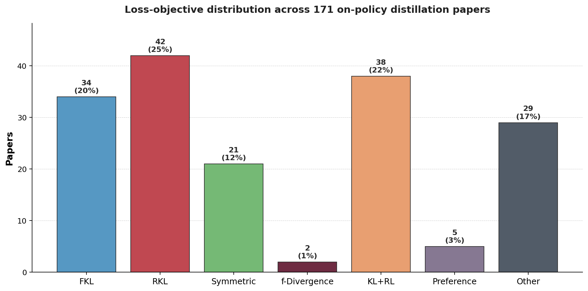
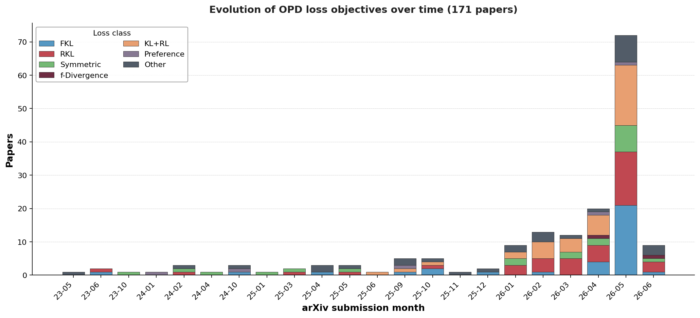

# Loss Taxonomy of On-Policy Distillation Papers

_Last updated: 2026-06-02. Auto-generated from `data/loss_classification.json`. Re-run `scripts/generate_loss_taxonomy.py` to refresh._

Each of the **171** OPD papers in this collection is assigned exactly one of seven mutually-exclusive loss classes. Classification is performed by an LLM auditor that reads each paper's `loss_formulation` (LaTeX), training-loop description, and key components, then picks the dominant objective per the rules in `data/loss_taxonomy_schema.json`.

## Class definitions (compact)

### FKL — Forward KL  ·  **34** papers (19.9%)

`D_KL( \pi_T(\cdot|x) \| \pi_\theta(\cdot|x) )`

_Match rule._ Loss is dominated by forward KL where the teacher distribution is the first argument (mode-covering). Includes classical KD with KL(teacher || student), CE-on-teacher-soft-targets when explicitly equivalent.

### RKL — Reverse KL  ·  **42** papers (24.6%)

`D_KL( \pi_\theta(\cdot|x) \| \pi_T(\cdot|x) )`

_Match rule._ Loss is dominated by reverse KL where the student distribution is the first argument (mode-seeking). MiniLLM-style policy-gradient interpretations also fall here when the underlying objective is RKL to a teacher.

### Symmetric — Symmetric / Skewed KL / JSD / GKL  ·  **21** papers (12.3%)

`D_JSD, D_skew-KL_\alpha, D_GKL, or any symmetrized KL combination`

_Match rule._ Jensen-Shannon divergence; skewed forward/reverse KL with mixture distribution \alpha\pi_T + (1-\alpha)\pi_\theta inside; bidirectional sum a*FKL + b*RKL with both nontrivial; total variation between teacher and student.

### f-Divergence — Other f-divergence (alpha / Renyi / Tsallis / chi-squared)  ·  **2** papers (1.2%)

`D_\alpha, D_Renyi, D_chi2, ... (any f-divergence beyond KL/JSD)`

_Match rule._ Adaptive KL family that interpolates a parameter between FKL and RKL via alpha-divergence (AKL / TAID-style). Renyi divergence. Chi-squared. Tsallis.

### KL+RL — Hybrid KL distill + RL reward  ·  **38** papers (22.2%)

`L = D_KL(teacher, student) + \lambda \cdot R(x,a) (or GRPO/PPO surrogate with teacher KL)`

_Match rule._ Loss explicitly mixes a teacher-KL distillation term with a verifiable reward / advantage / GRPO / PPO surrogate signal. Both terms must be load-bearing (removing either breaks the contribution).

### Preference — Preference / Pairwise / DPO-style  ·  **5** papers (2.9%)

`DPO-style log-ratio margin between chosen and rejected responses, optionally with a KL-to-teacher hinge`

_Match rule._ Preference-pair loss is the primary distillation signal: DPO, IPO, SimPO, or preference-gap KL where teacher provides the chosen response and student avoids rejected.

### Other — Other / Bespoke (NLL, MSE, Contrastive, special)  ·  **29** papers (17.0%)

`any objective that does not fit the six classes above`

_Match rule._ MSE on hidden states, contrastive InfoNCE between teacher/student embeddings, NLL on teacher-rolled-out sequences with no KL term, bespoke metric losses.

## Distribution snapshot

| Class | Papers | Share |
|---|---:|---:|
| FKL | 34 | 19.9% |
| RKL | 42 | 24.6% |
| Symmetric | 21 | 12.3% |
| f-Divergence | 2 | 1.2% |
| KL+RL | 38 | 22.2% |
| Preference | 5 | 2.9% |
| Other | 29 | 17.0% |
| **Total** | **171** | 100% |

_Confidence breakdown: high=118, medium=52, low=1._

## Per-paper assignments

### FKL (34)

| arXiv | Title | Conf | Evidence |
|---|---|---|---|
| [2606.00147](https://arxiv.org/abs/2606.00147) | RAFT: Data Refinement and Adaptive Distillation for Domain Fine-Tuning with Alleviated ... | high | L_KL = (T^2/N) Σ KL(q̃ ∥ p̃) where q̃ is teacher soft target, p̃ is student — forward KL(teacher \|\| student). |
| [2605.27255](https://arxiv.org/abs/2605.27255) | Pair-In, Pair-Out: Latent Multi-Token Prediction for Efficient LLMs | medium | Token-level distillation using teacher probability on student rollouts corresponds to cross-entropy with teacher soft targets, ... |
| [2605.27186](https://arxiv.org/abs/2605.27186) | MAIGO: Mitigating Lost-in-Conversation with History-Cleaned On-Policy Self-Distillation | medium | Token-level distillation from clean self-references implies KL(teacher\|\|student) or CE on teacher soft targets, standard forw... |
| [2605.27115](https://arxiv.org/abs/2605.27115) | Counteraction-Aware Multi-Teacher On-Policy Distillation for General Capability Recover... | medium | Token-level teacher-student log-probability gap distillation loss corresponds to cross-entropy on teacher soft targets, equival... |
| [2605.26844](https://arxiv.org/abs/2605.26844) | Not All Disagreement Is Learnable: Token Teachability in On-Policy Distillation | medium | On-Policy Distillation (OPD) token-level KL loss selectively applied; standard OPD uses forward KL (teacher\|\|student) for tok... |
| [2605.22511](https://arxiv.org/abs/2605.22511) | Search-E1: Self-Distillation Drives Self Evolution in Search-Augmented Reasoning | high | Token-level forward KL: D_KL(π_unprivileged ∥ π_privileged), matching KL(teacher ∥ student) with privileged model as teacher. |
| [2605.22240](https://arxiv.org/abs/2605.22240) | Unlocking Proactivity in Task-Oriented Dialogue | medium | KL-based self-distillation from privileged teacher to student implies standard KD with KL(teacher \|\| student), i.e., forward KL. |
| [2605.21924](https://arxiv.org/abs/2605.21924) | Visual-Advantage On-Policy Distillation for Vision-Language Models | medium | Token-level KL distillation with Visual-Advantage reweighting; on-policy distillation from teacher to student implies KL(teache... |
| [2605.21834](https://arxiv.org/abs/2605.21834) | On-Policy Consistency Training Improves LLM Safety with Minimal Capability Degradation | medium | KL divergence between student (perturbed prompt) and teacher (clean prompt) distributions, consistent with forward KL D_KL(teac... |
| [2605.21606](https://arxiv.org/abs/2605.21606) | When Are Teacher Tokens Reliable? Position-Weighted On-Policy Self-Distillation for Rea... | high | Clipped forward-KL: D_KL(π_teacher ∥ π_student) with position weight w(r) increasing along normalized position. |
| [2605.20643](https://arxiv.org/abs/2605.20643) | AVSD: Adaptive-View Self-Distillation by Balancing Consensus and Teacher-Specific Privi... | medium | Token-level KL with geometric target from consensus/teacher views implies KL(teacher_target \|\| student), i.e., forward KL dis... |
| [2605.19433](https://arxiv.org/abs/2605.19433) | Backtracking When It Strays: Mitigating Dual Exposure Biases in LLM Reasoning Distillation | medium | Token-level KL guided by teacher token probabilities on student trajectories implies KL(teacher \|\| student) forward KL distil... |
| [2605.18740](https://arxiv.org/abs/2605.18740) | Vision-OPD: Learning to See Fine Details for Multimodal LLMs via On-Policy Self-Distill... | medium | Token-level KL divergence between crop-conditioned teacher and full-image student, standard KD formulation KL(teacher \|\| stud... |
| [2605.17873](https://arxiv.org/abs/2605.17873) | HINT-SD: Targeted Hindsight Self-Distillation for Long-Horizon Agents | medium | Token-level distillation loss with teacher conditioned on hindsight generating soft targets for student, consistent with CE/FKL... |
| [2605.17497](https://arxiv.org/abs/2605.17497) | Self-Supervised On-Policy Distillation for Reasoning Language Models | medium | Token-level KL distillation from teacher to student at failed prefixes indicates KL(teacher \|\| student) direction. |
| [2605.15239](https://arxiv.org/abs/2605.15239) | Reducing the Safety Tax in LLM Safety Alignment with On-Policy Self-Distillation | high | DKL(pT ∥ pS) per token along student rollout is forward KL with teacher as first argument. |
| [2605.13501](https://arxiv.org/abs/2605.13501) | Reward-Weighted On-Policy Distillation with an Open Property-Equivalence Verifier for N... | high | L_OPD = -sum p_T(v\|x) log p_S(v\|x) is cross-entropy equivalent to forward KL(teacher\|\|student), reward weights scale but do... |
| [2605.11458](https://arxiv.org/abs/2605.11458) | Adaptive Teacher Exposure for Self-Distillation in LLM Reasoning | high | Primary student loss is KL(p_T^{α_t}(·\|…) \|\| p_S(·\|…)), forward KL with teacher as first argument. |
| [2605.09548](https://arxiv.org/abs/2605.09548) | Crosslingual On-Policy Self-Distillation for Multilingual Reasoning | high | Loss is KL(π_teacher(·\|x_en, r_en) ∥ π_student(·\|x_low)), i.e., forward KL with teacher as first argument. |
| [2605.09329](https://arxiv.org/abs/2605.09329) | Test-Time Speculation | high | Dominant term is KL(p \|\| q): teacher p is first argument, student q is second, i.e., forward KL distillation. |
| [2605.08741](https://arxiv.org/abs/2605.08741) | Training with Harnesses: On-Policy Harness Self-Distillation for Complex Reasoning | high | Loss is KL(p_θ̃(·\|harness context) \|\| p_θ(·\|x)), i.e., teacher distribution is first argument — forward KL. |
| [2605.05940](https://arxiv.org/abs/2605.05940) | Near-Policy: Accelerating On-Policy Distillation via Asynchronous Generation and Select... | high | L_KD = sum p_T(c) log(p_T(c)/p_S(c)) is KL(teacher \|\| student), i.e., forward KL. |
| [2604.26573](https://arxiv.org/abs/2604.26573) | PAINT: Partial-Solution Adaptive Interpolated Training for Self-Distilled Reasoners | high | Loss is clipped forward KL: sum of p_T(v)[log p_T(v) - log p_S(v)] with clipping, i.e., KL(teacher \|\| student). |
| [2604.24005](https://arxiv.org/abs/2604.24005) | TCOD: Exploring Temporal Curriculum in On-Policy Distillation for Multi-turn Autonomous... | high | Loss is D_KL(π_ϕ(a_t\|h_t) \|\| π_θ(a_t\|h_t)), teacher distribution as first argument — forward KL. |
| [2604.10688](https://arxiv.org/abs/2604.10688) | SCOPE: Signal-Calibrated On-Policy Distillation Enhancement with Dual-Path Adaptive Wei... | medium | L_OPD on wrong trajectories is KL distillation from teacher logprobs on student-generated sequences, weighted by teacher PPL in... |
| [2604.07430](https://arxiv.org/abs/2604.07430) | HY-Embodied-0.5: Embodied Foundation Models for Real-World Agents | high | Loss is KL(π_t(·\|x,y_{<t}) \|\| π_s(·\|x,y_{<t})) — forward KL with teacher as first argument, token-level. |
| [2602.06019](https://arxiv.org/abs/2602.06019) | Multi-Token Prediction via Self-Distillation | high | Loss is -P_θT(y'\|x) log P_θS(y'\|x), which is cross-entropy with teacher weights, equivalent to forward KL (D_KL(teacher\|\|st... |
| [2512.05105](https://arxiv.org/abs/2512.05105) | Semantic Soft Bootstrapping: Long Context Reasoning in LLMs without Reinforcement Learning | high | KL(softmax(teacher_logits/T) \|\| softmax(student_logits/T)) — teacher distribution is first argument, classic forward KL disti... |
| [2510.24021](https://arxiv.org/abs/2510.24021) | SelecTKD: Selective Token-Weighted Knowledge Distillation for LLMs | medium | Default D(p_t‖q_t) is KL(teacher‖student), i.e., forward KL. Paper is objective-agnostic but primary experiments use FKL. |
| [2510.07842](https://arxiv.org/abs/2510.07842) | AdaSwitch: Balancing Exploration and Guidance in Knowledge Distillation via Adaptive Sw... | high | Loss is D(M_t ∥ M_s) = per-token KL with teacher as first argument, i.e., KL(teacher \|\| student) = forward KL. |
| [2509.14526](https://arxiv.org/abs/2509.14526) | Delta Knowledge Distillation for Large Language Models | high | L_delta-KD = D_KL(π_s*(·\|x) \|\| π_θ(·\|x)), teacher-like synthetic distribution π_s* is the first argument (forward KL). |
| [2504.11426](https://arxiv.org/abs/2504.11426) | A Dual-Space Framework for General Knowledge Distillation of Large Language Models | high | Both L^{stu}_{kd} and L^{tea}_{kd} use D(teacher_distribution \|\| student_distribution), i.e., forward KL with teacher as firs... |
| [2410.11325](https://arxiv.org/abs/2410.11325) | Speculative Knowledge Distillation: Bridging the Teacher-Student Gap through Interleave... | high | Loss is D(M_T \|\| M_s) = KL with teacher as first argument, i.e., forward KL D_KL(teacher \|\| student). |
| [2306.13649](https://arxiv.org/abs/2306.13649) | On-Policy Distillation of Language Models: Learning from Self-Generated Mistakes | medium | Loss formulation uses D(p_T \|\| p_S^θ), which is forward KL with teacher as first argument, as the primary divergence. |

### RKL (42)

| arXiv | Title | Conf | Evidence |
|---|---|---|---|
| [deepseekv4](https://arxiv.org/abs/deepseekv4) | DeepSeek-V4: Towards Highly Efficient Million-Token Context Intelligence | high | Loss formulation explicitly states KL(p_student \|\| p_teacher) over full vocabulary, which is reverse KL with student as first... |
| [2606.02530](https://arxiv.org/abs/2606.02530) | SafeSteer: Localized On-Policy Distillation for Efficient Safety Alignment | high | Loss is Σ p_s(v) log(p_s(v)/p_t(v)), which is D_KL(student \|\| teacher), i.e., reverse KL. |
| [2606.00564](https://arxiv.org/abs/2606.00564) | Decomposed On-Policy Distillation for Vision-Language Reasoning: Steering Gradients for... | medium | Rollouts sampled from student policy (on-policy), loss computed over τ~p^θ_S(·\|I,x), consistent with reverse KL / MiniLLM-styl... |
| [2606.00305](https://arxiv.org/abs/2606.00305) | Bridging Reasoning Trajectories in On-Policy Distillation via Near-Future Guidance | medium | L_OPD is reverse-KL on student rollouts (on-policy distillation). L_traj adds KL from teacher trajectories but supplements the ... |
| [2605.31490](https://arxiv.org/abs/2605.31490) | Are Full Rollouts Necessary for On-Policy Distillation? | high | Policy gradient with y~pi_theta and reward r_t = log pi_g - log pi_theta is the REINFORCE gradient of reverse KL D_KL(pi_theta ... |
| [2605.30251](https://arxiv.org/abs/2605.30251) | Same Evidence, Different Answers: Canonical-Context On-Policy Distillation for Multi-Tu... | high | Loss formula explicitly shows D_KL(pi_theta(.\|h,y_{<t}) \|\| pi_0(.\|c,y_{<t})) — student first argument, teacher second — rev... |
| [2605.27028](https://arxiv.org/abs/2605.27028) | Less is More: Early Stopping Rollout for On-Policy Distillation | medium | Token-level distillation on student rollout sequences implies on-policy/reverse KL: student generates, teacher scores, minimizi... |
| [2605.20258](https://arxiv.org/abs/2605.20258) | It Takes Two: Complementary Self-Distillation for Contextual Integrity in LLMs | high | Loss formulation explicitly states D_KL(π_θ ∥ π_utility) and D_KL(π_θ ∥ π_privacy), both reverse KL with student as first argum... |
| [2605.15532](https://arxiv.org/abs/2605.15532) | DeltaPrompts: Escaping the Zero-Delta Trap in Multimodal Distillation | high | Loss formulation explicitly states KL(Pθ(·\|x) ∥ PT(·\|x)), which is reverse KL with student as first argument. |
| [2605.15113](https://arxiv.org/abs/2605.15113) | Learning from Language Feedback via Variational Policy Distillation | high | M-step loss: D_KL(π_θ(·\|x,y_{<t}) ∥ sg[q_ϕ'(·\|x,C,y_{<t})]) — student is first argument, teacher second. |
| [2605.12741](https://arxiv.org/abs/2605.12741) | Learning with Rare Success but Rich Feedback via Reflection-Enhanced Self-Distillation | medium | Loss sums π_θ(v\|…)·f(τ) over vocab; with f for reverse KL this is E_student[log(student/teacher)], i.e. D_KL(π_θ\|\|π_old). |
| [2605.12483](https://arxiv.org/abs/2605.12483) | Beyond GRPO and On-Policy Distillation: An Empirical Sparse-to-Dense Reward Principle f... | medium | J_0(θ) = -β E_x KL(π_θ ∥ π_T): on-policy reverse KL is the dominant OPD distillation objective (Stage2b). |
| [2605.12400](https://arxiv.org/abs/2605.12400) | OGLS-SD: On-Policy Self-Distillation with Outcome-Guided Logit Steering for LLM Reasoning | high | Loss is KL[π_θ(·\|x) \|\| π_T(·\|x)], student distribution as first argument — reverse KL. |
| [2605.11739](https://arxiv.org/abs/2605.11739) | Learning to Foresee: Unveiling the Unlocking Efficiency of On-Policy Distillation | high | Loss is D_KL(π_θ(y\|x) \|\| π*(y\|x)) with expectation over student samples y∼π_θ, which is reverse KL. |
| [2605.08776](https://arxiv.org/abs/2605.08776) | Reasoning Compression with Mixed-Policy Distillation | medium | Loss formula: KL(π_s(·\|x,ỹ_{<i};θ) ∥ π_t(·\|x,ỹ_{<i};φ)) — student is first argument, making this reverse KL. |
| [2605.08737](https://arxiv.org/abs/2605.08737) | The Extrapolation Cliff in On-Policy Distillation of Near-Deterministic Structured Outputs | medium | Advantage A=λ·log(πT/πB)−log(πS/πB) is a scaled reverse-KL-style signal driving student toward teacher under on-policy GRPO. |
| [2605.07865](https://arxiv.org/abs/2605.07865) | KL for a KL: On-Policy Distillation with Control Variate Baseline | high | The objective minimizes D_KL(π_θ(·\|c_t) ∥ π_T(·\|c_t)) via policy gradient with on-policy student samples — reverse KL to teac... |
| [2605.07711](https://arxiv.org/abs/2605.07711) | SimCT: Recovering Lost Supervision for Cross-Tokenizer On-Policy Distillation | high | Loss is KL(q^SimCT_S \|\| q^SimCT_T), i.e., student distribution as first argument — reverse KL. |
| [2605.02971](https://arxiv.org/abs/2605.02971) | Multilingual Safety Alignment via Self-Distillation | high | Loss explicitly minimizes D_KL(p_S(·\|x_tgt, y_{<t}) \|\| p_T(·\|x_tgt, x*, C, y_{<t})), which is reverse KL with student as fi... |
| [2605.00642](https://arxiv.org/abs/2605.00642) | Learn where to Click from Yourself: On-Policy Self-Distillation for GUI Grounding | high | Loss is D_KL(P^S(y_t) \|\| P^T(y_t)) with expectation over student samples y ~ P^S, which is reverse KL. |
| [2604.17535](https://arxiv.org/abs/2604.17535) | OPSDL: On-Policy Self-Distillation for Long-Context Language Models | high | Policy gradient with advantage A_t = log π_Teacher - log π_θ under on-policy student samples is the REINFORCE gradient of rever... |
| [2604.14084](https://arxiv.org/abs/2604.14084) | TIP: Token Importance in On-Policy Distillation | high | Loss is D_KL(P_S(·\|c_t) ‖ P_T(·\|c_t)), i.e., student distribution as first argument — reverse KL. |
| [2604.13010](https://arxiv.org/abs/2604.13010) | Lightning OPD: Efficient Post-Training for Large Reasoning Models with Offline On-Polic... | high | A_t = log π_T - log π_θ; maximizing J_off = E[Σ A_t] minimizes E_{π_ref}[log π_θ - log π_T], equivalent to reverse KL under π_r... |
| [2604.12002](https://arxiv.org/abs/2604.12002) | Self-Distillation Zero: Self-Revision Turns Binary Rewards into Dense Supervision | high | L_Self-Distillation uses D_KL(π_θ(·\|x,y_{<t}) \|\| π_{θ_SRT}(·\|x,y,P_r,y_{<t})), student is first argument = reverse KL. |
| [2604.08527](https://arxiv.org/abs/2604.08527) | Demystifying OPD: Length Inflation and Stabilization Strategies for Large Language Models | high | Token-level reverse-KL advantage Aᵢ,ₜ = log πT − log πθ used in GRPO-clip objective is policy-gradient minimization of D_KL(πθ‖... |
| [2603.26666](https://arxiv.org/abs/2603.26666) | VLA-OPD: Bridging Offline SFT and Online RL for Vision-Language-Action Models via On-Po... | high | Objective is J(θ) = E_{s~π_θ}[-D_KL(π_θ(·\|s) \|\| π_tea(·\|s))], explicitly reverse KL with student as first argument. |
| [2603.24596](https://arxiv.org/abs/2603.24596) | X-OPD: Cross-Modal On-Policy Distillation for Capability Alignment in Speech LLMs | high | Advantage A_cm = log π_teacher - log π_student; policy gradient with this advantage minimizes RKL(student \|\| teacher) in Mini... |
| [2603.16856](https://arxiv.org/abs/2603.16856) | Online Experiential Learning for Language Models | high | Loss is D_KL(π_θ(·\|x,y<t) \|\| π_teacher(·\|e,x,y<t)) — student is first argument, classic reverse KL. |
| [2603.11137](https://arxiv.org/abs/2603.11137) | Scaling Reasoning Efficiently via Relaxed On-Policy Distillation | high | Reward R_i,t = log(π_T/π_θ) under on-policy student samples with stop-gradient is policy-gradient interpretation of reverse KL ... |
| [2603.05433](https://arxiv.org/abs/2603.05433) | On-Policy Self-Distillation for Reasoning Compression | high | Loss is DKL(π_θ(·\|x,y<t) \|\| π̄_θ(·\|x,c,y<t)) — student is first argument, teacher second, classic reverse KL. |
| [2602.15260](https://arxiv.org/abs/2602.15260) | Fast and Effective On-policy Distillation from Reasoning Prefixes | high | Loss is sum of log(πs/πT) over student-sampled tokens, which is the reverse KL D_KL(πs \|\| πT). |
| [2602.12275](https://arxiv.org/abs/2602.12275) | On-Policy Context Distillation for Language Models | high | Loss is D_KL(π_θ(·\|x,y_{<t}) \|\| π_teacher(·\|c,x,y_{<t})), student in first argument = reverse KL. |
| [2602.02994](https://arxiv.org/abs/2602.02994) | Video-OPD: Efficient Post-Training of Multimodal Large Language Models for Temporal Vid... | high | Token reward r_t = -(log π_θ - log π_tea) is policy-gradient minimization of reverse KL D_KL(π_θ \|\| π_tea), MiniLLM-style. |
| [2602.02405](https://arxiv.org/abs/2602.02405) | Didactic to Constructive: Turning Expert Solutions into Learnable Reasoning | high | Dominant term is D_KL(M_θ(·\|x,r_{<t}) \|\| M_PS(·\|r_{<t})), reverse KL with student as first argument, teacher (privileged st... |
| [2601.20802](https://arxiv.org/abs/2601.20802) | Reinforcement Learning via Self-Distillation | medium | Loss is KL(π_θ(·\|x,y_{<t}) \|\| stopgrad(π_θ(·\|x,f,y_{<t}))), student in first argument = reverse KL direction. |
| [2601.19897](https://arxiv.org/abs/2601.19897) | Self-Distillation Enables Continual Learning | high | Loss is D_KL(π_θ(·\|x) \|\| π(·\|x,c)), expectation under student π_θ — reverse KL with student as first argument. |
| [2601.08310](https://arxiv.org/abs/2601.08310) | ORBIT: On-policy Exploration-Exploitation for Controllable Multi-Budget Reasoning | high | L_fusion minimizes E_{o~πϕ}[Σ_t log(πϕ/πθk)], which is on-policy reverse KL D_KL(πϕ \|\| πθk) from student to teacher. |
| [2510.11615](https://arxiv.org/abs/2510.11615) | LLM-Oriented Token-Adaptive Knowledge Distillation | high | Loss formulation explicitly states D_KL(q_θ \|\| p), i.e., KL with student q_θ as first argument and teacher p as second. |
| [2505.09388](https://arxiv.org/abs/2505.09388) | Qwen3 Technical Report | high | L_{on-policy} = D_{KL}(π_θ ∥ π_T), student is first argument, teacher second — reverse KL. |
| [2503.02832](https://arxiv.org/abs/2503.02832) | AlignDistil: Token-Level Language Model Alignment as Adaptive Policy Distillation | high | Loss is D_KL(π_θ(·\|ŷ<t,x) ‖ π*(·\|ŷ<t,x)), student is first argument — reverse KL. |
| [2402.12842](https://arxiv.org/abs/2402.12842) | PromptKD: Distilling Student-Friendly Knowledge for Generative Language Models via Prom... | high | L_student = D_KL(q_θ(y\|x) \|\| p(y\|P,x)) is reverse KL with student as first argument, the primary student training objective. |
| [2306.08543](https://arxiv.org/abs/2306.08543) | MiniLLM: On-Policy Distillation of Large Language Models | high | Primary objective is KL[q_θ ∥ p] = D_KL(student ∥ teacher), the reverse KL, optimized via policy gradient. |

### Symmetric (21)

| arXiv | Title | Conf | Evidence |
|---|---|---|---|
| [2606.01249](https://arxiv.org/abs/2606.01249) | Trust Region On-Policy Distillation | high | Loss combines RKL (K1 estimator on trust region) and FKL (outlier tokens + off-policy teacher prefix), both load-bearing direct... |
| [2605.28014](https://arxiv.org/abs/2605.28014) | ROSD: Reflective On-Policy Self-Distillation for Language Model Reasoning across Domains | medium | Loss formulation states 'JSD used in practice' despite the KL written in the equation. |
| [2605.22263](https://arxiv.org/abs/2605.22263) | Tailoring Teaching to Aptitude: Direction-Adaptive Self-Distillation for LLM Reasoning | medium | Direction-adaptive KL combines forward KL (pull at low-entropy) and reverse KL (push at high-entropy) token-level, mixing both ... |
| [2605.18299](https://arxiv.org/abs/2605.18299) | SD-Search: On-Policy Hindsight Self-Distillation for Search-Augmented Reasoning | high | Token-level Jensen-Shannon divergence DJS(teacher ∥ student) at search-query positions is the primary loss. |
| [2605.12652](https://arxiv.org/abs/2605.12652) | Multi-Rollout On-Policy Distillation via Peer Successes and Failures | medium | Loss uses D_KL(π_θ \|\| q_ϕ) for math and D_JS for other tasks; JSD is a symmetric divergence qualifying as Symmetric class. |
| [2605.10189](https://arxiv.org/abs/2605.10189) | ProteinOPD: Towards Effective and Efficient Preference Alignment for Protein Design | high | Loss is JSD_0.5(p_S \|\| p_PoE), a symmetric Jensen-Shannon divergence between student and teacher product-of-experts. |
| [2605.09725](https://arxiv.org/abs/2605.09725) | On-Policy Distillation with Best-of-N Teacher Rollout Selection | high | Dual-branch loss combines RKL (student-context KL(π_S\|\|π_T)) and FKL (teacher-context KL(π_T\|\|π_S)) with λ=10, both load-be... |
| [2605.06597](https://arxiv.org/abs/2605.06597) | UniSD: Towards a Unified Self-Distillation Framework for Large Language Models | high | D_t^(α) = αD(π_T*‖M_t) + (1-α)D(π_θ‖M_t) is JSD (Jensen-Shannon divergence) as the primary distillation signal. |
| [2605.01347](https://arxiv.org/abs/2605.01347) | MAD-OPD: Breaking the Ceiling in On-Policy Distillation via Multi-Agent Debate | medium | Key components state 'Task-adaptive divergence: JSD_0.5 for agentic, Reverse KL for code' — JSD is a symmetric divergence used ... |
| [2604.07944](https://arxiv.org/abs/2604.07944) | On-Policy Distillation of Language Models for Autonomous Vehicle Motion Planning | high | Loss is D^(β)_JSD with β=0.5 between teacher and student distributions — Jensen-Shannon divergence. |
| [2604.04461](https://arxiv.org/abs/2604.04461) | DP-OPD: Differentially Private On-Policy Distillation for Language Models | medium | GKD loss with β controlling forward/reverse-KL mixture; this is a generalized KL combining both directions. |
| [2603.11178](https://arxiv.org/abs/2603.11178) | PACED: Distillation and Self-Distillation at the Frontier of Student Competence | medium | Two-stage schedule: 50% steps Forward-KL then 50% steps Reverse-KL. Both directions are load-bearing and contribute equally. |
| [2603.07079](https://arxiv.org/abs/2603.07079) | Entropy-Aware On-Policy Distillation of Language Models | high | Loss combines PPO-clip reverse KL (low-entropy tokens) and top-k truncated forward KL (high-entropy tokens), both teacher-direc... |
| [2601.18734](https://arxiv.org/abs/2601.18734) | Self-Distilled Reasoner: On-Policy Self-Distillation for Large Language Models | high | Loss is JSD_β = β·D_KL(p_T∥m) + (1-β)·D_KL(p_S∥m), m=βp_T+(1-β)p_S, a skewed Jensen-Shannon divergence. |
| [2601.07155](https://arxiv.org/abs/2601.07155) | Stable On-Policy Distillation through Adaptive Target Reformulation | medium | Target Q∝P_T·P_S^β is a mixture/interpolation between teacher and student; KL to Q is neither pure FKL nor RKL. |
| [2505.16297](https://arxiv.org/abs/2505.16297) | ToDi: Token-wise Distillation via Fine-Grained Divergence Control | high | Loss is α·FKL + (1-α)·RKL per token, a bidirectional weighted combination of forward and reverse KL with both nontrivial. |
| [2503.07067](https://arxiv.org/abs/2503.07067) | DistiLLM-2: A Contrastive Approach Boosts the Distillation of LLMs | high | Loss combines SKL (skewed forward KL) on teacher responses and SRKL (skewed reverse KL) on student responses with dynamic α mix... |
| [2501.16937](https://arxiv.org/abs/2501.16937) | TAID: Temporally Adaptive Interpolated Distillation for Efficient Knowledge Transfer in... | high | Loss is KL(p_t \|\| q_θ) where p_t = (1-t)·q'_θ + t·p_teacher, a skewed mixture distribution interpolating student and teacher. |
| [2404.02657](https://arxiv.org/abs/2404.02657) | Rethinking Kullback-Leibler Divergence in Knowledge Distillation for Large Language Models | high | AKL combines FKL and RKL with adaptive weights g_head/(g_head+g_tail) and g_tail/(g_head+g_tail), both nontrivial. |
| [2402.03898](https://arxiv.org/abs/2402.03898) | DISTILLM: Towards Streamlined Distillation for Large Language Models | high | Loss uses skewed KL: D_KL(p, αp+(1-α)q_θ) or D_KL(q_θ, (1-α)p+αq_θ), mixture distribution inside defines skew-KL. |
| [2310.08461](https://arxiv.org/abs/2310.08461) | DistillSpec: Improving Speculative Decoding via Knowledge Distillation | medium | Loss uses D ∈ {FKL, RKL, JSD[β], TVD}; JSD and TVD are symmetric divergences; paper treats divergence selection as key contribu... |

### f-Divergence (2)

| arXiv | Title | Conf | Evidence |
|---|---|---|---|
| [2606.01039](https://arxiv.org/abs/2606.01039) | OPD+: Rethinking the Advantage Design for On-Policy Distillation | high | Loss uses general f-divergence framework with w_f(u) = -f(u) + u*f'(u), generalizing beyond KL to arbitrary f-divergences. |
| [2604.20933](https://arxiv.org/abs/2604.20933) | IRIS: Interpolative Rényi Iterative Self-play for Large Language Model Fine-Tuning | high | Loss is Rényi divergence variational objective with adaptive order α interpolating between KL, JS, χ², Hellinger — a general f-... |

### KL+RL (38)

| arXiv | Title | Conf | Evidence |
|---|---|---|---|
| [2605.30833](https://arxiv.org/abs/2605.30833) | Your Teacher Can't Help You Here: Combating Supervision Fidelity Decay in On-Policy Dis... | high | Loss combines A_t (reverse-KL advantage: 1 + log π_θ - log π_T) with γ·r_conf (teacher confidence reward), both load-bearing. |
| [2605.15155](https://arxiv.org/abs/2605.15155) | Self-Distilled Agentic Reinforcement Learning | high | L = L_GRPO + λ_SDAR · L_SDAR where SDAR is gated (log π_T - log π_θ) distillation and GRPO is RL reward objective. |
| [2605.13255](https://arxiv.org/abs/2605.13255) | Respecting Self-Uncertainty in On-Policy Self-Distillation for Efficient LLM Reasoning | medium | Loss combines RL policy gradient (A_i reward advantage) with teacher-student log-prob difference w_{i,t} as token-level KL-like... |
| [2605.13230](https://arxiv.org/abs/2605.13230) | Teacher-Guided Policy Optimization for LLM Distillation | high | J_TGPO^D = J_GRPO + w·J_Guidance; GRPO is RL reward surrogate, J_Guidance is teacher-directed NLL (distillation). Both load-bea... |
| [2605.12227](https://arxiv.org/abs/2605.12227) | Combining On-Policy Optimization and Distillation for Long-Context Reasoning in Large L... | high | Loss combines GRPO clipped policy gradient (RL reward) with β·D_KL(π_θ ∥ π_teacher) distillation term; both are load-bearing. |
| [2605.11613](https://arxiv.org/abs/2605.11613) | From Generic Correlation to Input-Specific Credit in On-Policy Self Distillation | medium | R_t combines log π_ref (teacher/EMA signal) with contrastive baselines and environment feedback z, optimized via reverse-KL gra... |
| [2605.11609](https://arxiv.org/abs/2605.11609) | Anti-Self-Distillation for Reasoning RL via Pointwise Mutual Information | high | A_{i,t} = A^{seq}_i + λ·δ_t combines GRPO reward advantage with teacher-derived PMI (JSD ascent) per-token signal. |
| [2605.11019](https://arxiv.org/abs/2605.11019) | Efficient LLM Reasoning via Variational Posterior Guidance with Efficiency Awareness | medium | Variational ELBO objective combines KL between posterior and prior policy with efficiency-aware reward signal for reasoning. |
| [2605.10781](https://arxiv.org/abs/2605.10781) | Rebellious Student: Reversing Teacher Signals for Reasoning Exploration with Self-Disti... | medium | GRPO surrogate with per-token weight w^RLRT_t=(P_S/P_T)^sign(A) derived from KL(student\|\|teacher) modulating RL advantage for... |
| [2605.10194](https://arxiv.org/abs/2605.10194) | TRACE: Distilling Where It Matters via Token-Routed Self On-Policy Alignment | high | Loss combines GRPO (RL surrogate) with λ_k[μ_E·KL_F(π_T‖π_S) + μ_K·KL_R(π_S‖π_T)]; both terms are load-bearing during training. |
| [2605.08873](https://arxiv.org/abs/2605.08873) | CoDistill-GRPO: A Co-Distillation Recipe for Efficient Group Relative Policy Optimization | high | Effective reward r̃_i combines accuracy_reward with α·log(π_θ/π_φ) KL distillation term; both are load-bearing in GRPO surrogat... |
| [2605.07804](https://arxiv.org/abs/2605.07804) | PRUNE-OPD: Efficient and Reliable On-Policy Distillation for Long-Horizon Reasoning | medium | Loss combines per-position D_KL(p_t \|\| q_t) teacher distillation with RL-style reward weighting via reliability-weighted rewa... |
| [2605.07725](https://arxiv.org/abs/2605.07725) | SOD: Step-wise On-policy Distillation for Small Language Model Agents | high | L = L_GRPO + L^step_OPD combines RL reward (GRPO advantage) with teacher KL distillation; both are load-bearing. |
| [2605.07505](https://arxiv.org/abs/2605.07505) | LiteGUI: Distilling Compact GUI Agents with Reinforcement Learning | high | Stage1 uses reverse KL distillation (L_OPD with teacher logits), Stage2 uses GRPO with reward signals. Both are load-bearing co... |
| [2605.07177](https://arxiv.org/abs/2605.07177) | HyperEyes: Dual-Grained Efficiency-Aware Reinforcement Learning for Parallel Multimodal... | high | Loss explicitly combines L_GRPO (RL surrogate) with λ_kd * KL(π_θ \|\| π_teacher) on failed rollouts; both are load-bearing. |
| [2605.06387](https://arxiv.org/abs/2605.06387) | Asymmetric On-Policy Distillation: Bridging Exploitation and Imitation at the Token Level | high | Loss combines L^F_KL (forward KL to teacher) and L^OPD (policy gradient with teacher-derived advantage) via binary mask G_t. |
| [2605.03677](https://arxiv.org/abs/2605.03677) | Uni-OPD: Unifying On-Policy Distillation with a Dual-Perspective Recipe | high | G_OPD combines log πT/πθ (teacher KL distillation signal) with outcome reward R∈{0,1} via margin calibration; both are load-bea... |
| [2605.02943](https://arxiv.org/abs/2605.02943) | Healthcare AI GYM for Medical Agents | high | L_total = L_GRPO(θ_S; R_cos) + λ_distill · D_KL(π_θS \|\| π_θT), both GRPO reward and teacher KL are load-bearing. |
| [2604.27083](https://arxiv.org/abs/2604.27083) | Co-Evolving Policy Distillation | high | Loss combines GRPO surrogate (RLVR) with cross-branch token-level KL distillation (δ as advantage), both load-bearing in altern... |
| [2604.16830](https://arxiv.org/abs/2604.16830) | The Illusion of Certainty: Decoupling Capability and Calibration in On-Policy Distillation | high | Loss combines RL reward term (log π·𝟙[R=1]) with forward KL distillation D_KL(π_T̂ \|\| π_θ); both are load-bearing. |
| [2604.14054](https://arxiv.org/abs/2604.14054) | π-Play: Multi-Agent Self-Play via Privileged Self-Distillation without External Data | high | Loss combines GRPO surrogate L_{i,t} (RL reward) with λ D_{Distill}(π^S \|\| π^T) teacher KL distillation; both are load-bearing. |
| [2604.10674](https://arxiv.org/abs/2604.10674) | Skill-SD: Skill-Conditioned Self-Distillation for Multi-turn LLM Agents | high | L_total = L_GRPO + λ L_SDL, combining GRPO RL surrogate with skill-conditioned teacher distillation loss (importance-weighted k... |
| [2604.03128](https://arxiv.org/abs/2604.03128) | Self-Distilled RLVR | medium | GRPO surrogate with token-level w_t derived from teacher-student log-prob ratio (Δ_t) modulating the RL advantage signal. |
| [2604.02288](https://arxiv.org/abs/2604.02288) | Unifying Group-Relative and Self-Distillation Policy Optimization via Sample Routing | high | Loss aggregates GRPO (RL surrogate with clipped advantage) and DW-SDPO (self-distillation from EMA teacher logits), both load-b... |
| [2603.27703](https://arxiv.org/abs/2603.27703) | KAT-Coder-V2 Technical Report | medium | OPD stage combines expert teacher log-prob dense supervision (distillation) with sparse environment reward, both within turn-le... |
| [2603.23871](https://arxiv.org/abs/2603.23871) | HDPO: Hybrid Distillation Policy Optimization via Privileged Self-Distillation | high | L_HDPO = L_GRPO + λ·L_JSD, combining GRPO RL surrogate with JSD teacher distillation; both are load-bearing. |
| [2603.19220](https://arxiv.org/abs/2603.19220) | Nemotron-Cascade 2: Post-Training LLMs with Cascade RL and Multi-Domain On-Policy Disti... | high | MOPD uses token-level reverse-KL advantage from domain teachers combined with GRPO RL reward stages; both are load-bearing in c... |
| [2603.10165](https://arxiv.org/abs/2603.10165) | OpenClaw-RL: Train Any Agent Simply by Talking | high | A_t = w_binary * r_final + w_opd*(log π_teacher - log π_old) combines RL reward with teacher-distillation signal in PPO surrogate. |
| [2602.22495](https://arxiv.org/abs/2602.22495) | Reinforcement-aware Knowledge Distillation for LLM Reasoning | high | TRRD ratio fuses GRPO importance ratio with π_θS/π_θT teacher ratio, multiplied by reward-based advantage Â, combining RL and t... |
| [2602.12674](https://arxiv.org/abs/2602.12674) | X-KD: General Experiential Knowledge Distillation for Large Language Models | high | Loss combines D_β[π\|\|B_θ] (KL distillation term) with L_ex (experiential/reward objective using TD error and reward distribut... |
| [2602.12125](https://arxiv.org/abs/2602.12125) | Learning beyond Teacher: Generalized On-Policy Distillation with Reward Extrapolation | high | Loss combines λ·log(π*/π_ref) as reward signal with D_KL(π_θ\|\|π_ref) regularizer; teacher π* provides token-level reward, KL ... |
| [2602.04942](https://arxiv.org/abs/2602.04942) | Privileged Information Distillation for Language Models | high | J_OPSD combines reward R(o,s) with β·D_KL(π_θ^S \|\| sg(π_θ^T)) — explicit RL reward plus teacher KL distillation term. |
| [2602.00400](https://arxiv.org/abs/2602.00400) | KEPO: Knowledge-Enhanced Preference Optimization for Reinforcement Learning with Reasoning | high | Loss combines GRPO advantage-weighted RL term w_i(θ)Â_i with quality-gated teacher distillation D_T(π_T‖π_θ), both load-bearing. |
| [2601.16547](https://arxiv.org/abs/2601.16547) | CORD: Bridging the Audio–Text Reasoning Gap via Weighted On-policy Cross-modal Distilla... | high | LCORD = Ltok (weighted reverse KL distillation from text modality teacher) + Lseq (GRPO reward-based RL). Both are load-bearing. |
| [2601.02780](https://arxiv.org/abs/2601.02780) | MiMo-V2-Flash Technical Report | high | Â_MOPD,t combines sg[log(π_teacher/π_θ)] (token-level reverse KL advantage from teachers) with α*Â_ORM (GRPO reward advantage).... |
| [2510.23497](https://arxiv.org/abs/2510.23497) | VOLD: Reasoning Transfer from LLMs to Vision-Language Models via On-Policy Distillation | high | L_VOLD = L_GRPO + β·E[(1-r(τ))·KL(π_φ\|\|π_θ)], combining GRPO reward surrogate with teacher-to-student FKL distillation. |
| [2509.22921](https://arxiv.org/abs/2509.22921) | Rethinking Large Language Model Distillation: A Constrained Markov Decision Process Per... | high | Loss combines binary task reward R with KL constraint (cumulative KL to teacher as budget), both load-bearing in CMDP formulation. |
| [2506.02208](https://arxiv.org/abs/2506.02208) | KDRL: Post-Training Reasoning LLMs via Unified Knowledge Distillation and Reinforcement... | high | J_KDRL = J_GRPO − β·D^{k2}_KL(π_θ‖π_T) explicitly combines GRPO RL surrogate with teacher KL distillation term. |

### Preference (5)

| arXiv | Title | Conf | Evidence |
|---|---|---|---|
| [2605.05040](https://arxiv.org/abs/2605.05040) | Preference-Based Self-Distillation: Beyond KL Matching via Reward Regularization | high | Loss is DPO-style Bradley-Terry log σ(β[log-ratio margin]) with teacher as reference policy, paired chosen/rejected samples. |
| [2604.28123](https://arxiv.org/abs/2604.28123) | Beyond SFT-to-RL: Pre-alignment via Black-Box On-Policy Distillation for Multimodal RL | high | Bradley-Terry loss on discriminator comparing supervision y+ vs rollout y-, minimax adversarial preference-pair alignment. |
| [2509.25100](https://arxiv.org/abs/2509.25100) | ORPO-Distill: Mixed-Policy Preference Optimization for Cross-Architecture LLM Distillation | high | ORPO loss uses log-sigmoid of log-odds ratio between chosen (teacher) and rejected (student) responses—a pairwise preference ob... |
| [2410.09008](https://arxiv.org/abs/2410.09008) | SuperCorrect: Advancing Small LLM Reasoning with Thought Template Distillation and Self... | high | Stage-2 Cross-model DPO loss uses log-sigmoid margin between teacher-corrected positive and student-generated negative pairs, c... |
| [2401.01335](https://arxiv.org/abs/2401.01335) | Self-Play Fine-Tuning Converts Weak Language Models to Strong Language Models | high | SPIN loss uses logistic loss on log-ratio margins between chosen (human) and rejected (model-generated) responses, identical to... |

### Other (29)

| arXiv | Title | Conf | Evidence |
|---|---|---|---|
| [2606.02372](https://arxiv.org/abs/2606.02372) | COMAP: Co-Evolving World Models and Agent Policies for LLM Agents | medium | Loss is NLL on environment next-state prediction plus EMA self-distillation and BCE/NLL policy terms, no explicit KL divergence... |
| [2606.01476](https://arxiv.org/abs/2606.01476) | OmniOPD: Logit-Free On-Policy Distillation via Speculative Verification | medium | Loss is weighted NLL on teacher-scored chunks (semantic similarity scores as weights), not a KL divergence between teacher/stud... |
| [2606.01080](https://arxiv.org/abs/2606.01080) | ThinkSwitch: Context Distillation with LoRA and Weight Interpolation for Specific-Purpo... | high | QLoRA fine-tuning on teacher-generated answer-only sequences is NLL on hard labels, no KL divergence term present. |
| [2605.29584](https://arxiv.org/abs/2605.29584) | GAPD: Gold-Action Policy Distillation for Agentic Reinforcement Learning in Knowledge B... | medium | Loss is clipped PPO surrogate with fused advantage combining GRPO and gold-action guide scores; no explicit KL divergence to te... |
| [2605.28791](https://arxiv.org/abs/2605.28791) | Skill-Conditioned Gated Self-Distillation for LLM Reasoning | medium | Gated distillation objective uses bounded log-sigmoid of token gap squared, not a standard KL divergence formulation. |
| [2605.21851](https://arxiv.org/abs/2605.21851) | OPPO: Bayesian Value Recursion for Token-Level Credit Assignment in LLM Reasoning | medium | Policy gradient with token-level advantage from Bayesian value recursion; no explicit KL distillation term to a teacher distrib... |
| [2605.17862](https://arxiv.org/abs/2605.17862) | f-OPD: Stabilizing Long-Horizon On-Policy Distillation with Freshness-Aware Control | low | No equations or explicit loss formulation available; freshness-aware reweighting and policy drift constraint suggest bespoke mo... |
| [2605.13643](https://arxiv.org/abs/2605.13643) | Prefix Teach, Suffix Fade: Local Teachability Collapse in Strong-to-Weak On-Policy Dist... | medium | Loss is -A'_t log p_S(y_t\|x,y_{<t}): weighted NLL on student rollouts with BIC-truncated mask, no explicit KL to teacher distr... |
| [2605.11854](https://arxiv.org/abs/2605.11854) | Self-Distilled Trajectory-Aware Boltzmann Modeling: Bridging the Training-Inference Dis... | high | TABOM loss combines trajectory-aware reconstruction (NLL on masked tokens) and pairwise entropy ordering hinge loss—no KL diver... |
| [2605.07396](https://arxiv.org/abs/2605.07396) | Rubric-based On-policy Distillation | high | GRPO surrogate with rubric-based reward from teacher; KL term is only ref-policy regularization, no direct KL-to-teacher distil... |
| [2605.06094](https://arxiv.org/abs/2605.06094) | VISD: Enhancing Video Reasoning via Structured Self-Distillation | medium | Loss is GRPO clipped surrogate with teacher-modulated token weights; no explicit KL distillation term exists in the objective. |
| [2604.01193](https://arxiv.org/abs/2604.01193) | Embarrassingly Simple Self-Distillation Improves Code Generation | high | Standard CE/NLL on self-generated sequences with no KL term, no teacher distribution, no reward signal. |
| [2603.13260](https://arxiv.org/abs/2603.13260) | Explain in Your Own Words: Improving Reasoning via Token-Selective Dual Knowledge Disti... | medium | Loss combines Plackett-Luce ranking loss (preference-like but not pairwise DPO), entropy-gated JSD, and entropy minimization—no... |
| [2602.20574](https://arxiv.org/abs/2602.20574) | GATES: Self-Distillation under Privileged Context with Consensus Gating | medium | L_off is NLL on tutor rollout tokens; L_on is advantage-weighted policy gradient using tutor-student log-prob difference, not s... |
| [2602.13407](https://arxiv.org/abs/2602.13407) | On-Policy Supervised Fine-Tuning for Efficient Reasoning | high | NLL/CE on self-generated correct rollouts with no teacher distribution or KL term—standard on-policy SFT cross-entropy. |
| [2602.02482](https://arxiv.org/abs/2602.02482) | Expanding the Capabilities of Reinforcement Learning via Text Feedback | medium | RLTF-SD uses AWR-style RL with second-turn rollouts as targets; RLTF-FM adds NLL on teacher critique. No explicit KL(teacher\|\... |
| [2601.21968](https://arxiv.org/abs/2601.21968) | OVD: On-policy Verbal Distillation | high | Loss is PPO-clip surrogate with reward from teacher verbal scores; no KL divergence to teacher distribution appears in the obje... |
| [2601.09088](https://arxiv.org/abs/2601.09088) | Distribution-Aligned Sequence Distillation for Superior Long-CoT Reasoning | high | Loss is NLL on teacher-sampled sequences: L = -log p_S(ŷ\|x) where ŷ ~ p_T, no explicit KL term. |
| [2512.23097](https://arxiv.org/abs/2512.23097) | A Note on Hybrid Online Reinforcement and Imitation Learning for LLMs: Formulations and... | medium | Loss is KL(π_θ \|\| π_ref) + λ·reward. π_ref is a reference policy, not a teacher distribution for distillation. |
| [2511.10643](https://arxiv.org/abs/2511.10643) | Black-Box On-Policy Distillation of Large Language Models | high | GAN-style adversarial training: Bradley-Terry discriminator loss + GRPO with discriminator score as reward, no explicit KL to t... |
| [2510.18874](https://arxiv.org/abs/2510.18874) | Retaining by Doing: The Role of On-Policy Data in Mitigating Forgetting | medium | Paper compares RL (GRPO with KL to ref policy, no teacher) vs SFT baselines to study forgetting; no single dominant teacher-dis... |
| [2509.25837](https://arxiv.org/abs/2509.25837) | Distillation of Large Language Models via Concrete Score Matching | high | Concrete Score Matching loss: weighted squared difference of log-ratio (discrete score) between student and teacher, not a KL d... |
| [2509.14257](https://arxiv.org/abs/2509.14257) | From Correction to Mastery: Reinforced Distillation of Large Language Model Agents | high | Primary objectives are NLL on teacher trajectories (L_BC) and GRPO with key-step/final rewards. No KL divergence to teacher dis... |
| [2505.16142](https://arxiv.org/abs/2505.16142) | RLKD: Distilling LLMs' Reasoning via Reinforcement Learning | medium | GRPO with reward signals (R_acc, R_gsrm, R_format, R_tag); no explicit KL divergence to teacher distribution in the loss. |
| [2504.19024](https://arxiv.org/abs/2504.19024) | KETCHUP: K-Step Return Estimation for Sequential Knowledge Distillation | high | REINFORCE policy gradient with K-step Bellman return using teacher Q-values as reward; no explicit KL divergence term in loss. |
| [2504.14945](https://arxiv.org/abs/2504.14945) | Learning to Reason under Off-Policy Guidance | medium | JSHAPING combines clipped on-policy GRPO with regularized importance-weighted off-policy advantage; no explicit KL divergence t... |
| [2410.17215](https://arxiv.org/abs/2410.17215) | MiniPLM: Knowledge Distillation for Pre-Training Language Models | high | Loss is standard NLL/CE on student over curated corpus D'. No KL term between teacher and student distributions appears in trai... |
| [2402.12030](https://arxiv.org/abs/2402.12030) | Towards Cross-Tokenizer Distillation: the Universal Logit Distillation Loss for LLMs | high | Primary loss is Wasserstein-1 distance (W1) between sorted teacher and student probability vectors, not KL divergence. |
| [2305.12870](https://arxiv.org/abs/2305.12870) | Lion: Adversarial Distillation of Proprietary Large Language Models | high | Loss is NLL/CE on teacher-generated sequences: L = -sum_t log P_theta(y_t\|x,y_{<t}), no KL divergence term. |

## Methodology

- Source of truth: `notes/paper_notes.json` — every paper marked `is_opd=yes` is included.
- Classifier: `scripts/classify_loss_with_llm.py` (Claude Opus via woa gateway, no thinking, deterministic JSON output).
- Daily refresh: hooked into the OPD daily-pipeline cron after Phase 5 (Awesome inserter); only papers whose `loss_formulation` changed since last run are re-classified.
- Spot-check policy: any paper with `confidence=low` is reviewed manually before the next public refresh.
